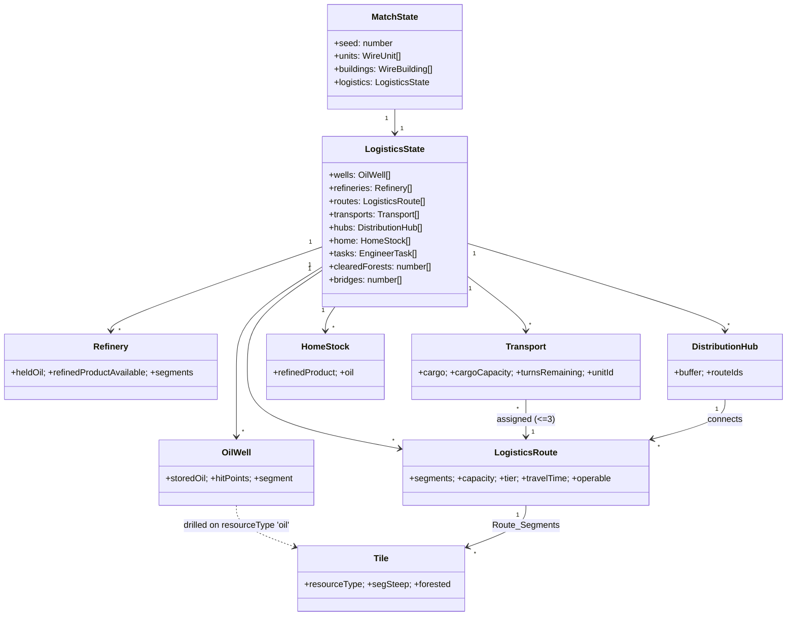

# Design Document — Oil Logistics System

## Overview

The Oil Logistics System adds a physical resource economy on top of the existing Drone
Domination world. Players extract raw **Oil** from generated **Oil_Deposits**, refine it
into **Refined_Product** at city-like, multi-hex **Refineries**, and move both commodities along
**Logistics_Routes** (physical roads/highways) via AI-driven **Transportation_Units**,
buffering flow through **Distribution_Hubs**, until Refined_Product accrues at the
**Home_City** where it is the sole currency for all construction and upgrades.

The design reuses existing engine primitives rather than inventing parallel ones:

| Existing primitive | Reused for |
|---|---|
| `Tile.resourceType` (`src/world/types.ts`) | Recording oil deposits at generation time (Req 1) |
| `mulberry32` + `graphDistance`/`tilesWithinRadius` (`src/world/rng.ts`, `pathfinding.ts`) | Deterministic, spaced deposit scattering (Req 1) |
| `segSteep[]` + `MAX_STEEP_WHEELED = 0.44` (`shared/movementConstants.ts`) | Well/refinery placement gate and route travel-time (Req 2, 4, 7) |
| `engineer` attribute 0–5 (`shared/unitTypes.ts`) | Well drilling, forest clearing, bridge building durations (Req 2, 9, 10) |
| `findPath`/`graphDistance` (`shared/pathfinding.ts`) | Contiguous road paths between endpoints (Req 6) |
| `CombatContext` + `computeDamage`/`applyDamage` (`src/world/combat.ts`) | Structure and transport hit points and destruction (Req 8, 12) |
| `MatchState` + `advanceTurn` (`shared/matchTypes.ts`, `server/matchApi.ts`) | Per-turn logistics resolution hook and authoritative mutable state |
| Compact wire format (`src/world/compact.ts` ↔ `shared/wireTypes.ts` ↔ `client/worldData.ts`) | Serializing logistics entities to the client |

The subsystem is authoritative on the server. Its pure rules live in a new
`src/world/logistics.ts` (mirroring how `shared/buildings.ts` holds pure placement rules),
its constants in `shared/logisticsConstants.ts`, and its wire/types in
`shared/logisticsTypes.ts` so the client can render and validate without importing `src/`.

### Design Goals

1. **Determinism** — deposit placement and every per-turn resolution step are pure
   functions of `(seed, state)`, matching the engine's existing determinism guarantee.
2. **Conservation** — Oil and Refined_Product are conserved across the pipeline except at
   explicitly-modelled loss points (refining conversion, storage/home clamps, destruction).
3. **Separation of concerns** — pure rules in `src/world` / `shared`, orchestration in
   `server`, rendering in `client`; the client never imports `src/` or `server/`.
4. **Reuse the combat model** — structures and transports gain hit points and are attacked
   through the same `CombatContext` path already used for units and buildings.

## Architecture

### Module Placement

Following the repo's layering (`client/` must not import `src/` or `server/`; `src/` and
`shared/` hold pure logic; `server/` orchestrates), the new code is distributed as:

```
shared/
  logisticsConstants.ts   NEW  Numeric constants + Construction_Cost table (Req 1,3,4,5,6,7,8,11)
  logisticsTypes.ts       NEW  Wire + authoritative entity shapes (OilWell, Refinery, Route, …)
  wireTypes.ts            EDIT WireWorld/CompactSave gain logistics payload
src/world/
  logistics.ts            NEW  Pure resolution engine: extraction, refining, transport,
                               travel-time, hubs, home accrual, construction/upgrade rules
  logisticsGen.ts         NEW  Deposit scattering during world generation (Req 1)
  logisticsSeed.ts        NEW  seedDefaultLogisticsNetwork() — deterministic example
                               network for the Default_Test_World only (Req 13)
  generate.ts             EDIT generateWorld() calls placeOilDeposits(); when seed ===
                               DEFAULT_SEED it also calls seedDefaultLogisticsNetwork()
  compact.ts              EDIT (de)serialize logistics entities to/from wire
  types.ts                EDIT World gains a `logistics?` container (authoritative)
  index.ts                EDIT barrel re-export logistics modules
shared/
  logisticsConstants.ts   EDIT DEFAULT_SEED + Transport_Tier thresholds (Req 13, 14)
server/
  logisticsApi.ts         NEW  Intent handlers (build/upgrade/clear/bridge/purchase)
  matchApi.ts             EDIT advanceTurn() invokes resolveLogisticsTurn(); Intent routing
client/
  worldData.ts            EDIT mirror logistics wire types; runtime overlays
  logisticsRenderer.ts    NEW  Scene wiring: place per-entity model Groups, roads/highways
  logisticsModel.ts       NEW  Model family orchestrator (mirrors unitModel.ts) — Req 14
  logisticsModelWell.ts   NEW  buildWellModel()      → THREE.Group (Req 14.1, 14.2)
  logisticsModelRefinery.ts NEW buildRefineryModel() → THREE.Group
  logisticsModelHub.ts    NEW  buildHubModel()       → THREE.Group
  logisticsModelTransport.ts NEW buildTransportModel(tier, factionHex) → THREE.Group (Req 14.3-14.5)
  logisticsModelRoad.ts   NEW  buildRoadMesh()/buildHighwayMesh() (Req 14.6)
  logisticsModelBridge.ts NEW  buildBridgeModel()    → THREE.Group
  logisticsController.ts  NEW  Build/upgrade UI actions -> logistics intents
  logisticsPanel.ts       NEW  Storage/route/home-stock HUD readouts
```

The `client/logisticsModel*` family mirrors the existing `client/unitModel*` family exactly
(a `logisticsModel.ts` orchestrator delegating to per-entity builders) and reuses
`client/unitModelHelpers.ts` (`BoltOnMaterials`, `createTintedMaterials`) and the same
`MeshStandardMaterial` conventions as `client/buildingModel.ts`, so every Logistics_Entity is
a detailed multi-part procedural mesh meeting or exceeding the Unit_Model_Standard (Req 14.1,
14.2) rather than a low-poly placeholder or reused sprite.

### State Ownership

The authoritative mutable logistics state lives alongside the match's mutable state.
`MatchState` (`shared/matchTypes.ts`) already holds `units`, `buildings`, and per-unit turn
budgets and is regenerated-tiles-plus-mutable-state by design. Logistics adds one container:

```
MatchState.logistics: LogisticsState   // NEW — see Data Models
```

Static deposits are NOT stored in `MatchState` (like tiles, they are a pure function of the
seed): `resolveLogisticsTurn` recovers deposit tiles from the seed-regenerated tiles via
`resourceType === 'oil'`. Player-built terrain mutations that are NOT derivable from the
seed (cleared forests, completed bridges, road membership) are stored as index overlays in
`LogisticsState`, exactly mirroring the existing `CompactSave.bridges: number[]` pattern in
`client/worldData.ts`.

### Where Logistics Hooks Into the Turn Loop

`server/matchApi.ts::advanceTurn()` is the single choke point where a faction's turn ends
and the next begins. The per-turn logistics pipeline runs there, resolving the outgoing
faction's economy before control passes on:

```mermaid
flowchart TD
  A[endTurn intent] --> B[advanceTurn in matchApi]
  B --> C[resolveLogisticsTurn(state, tiles, faction)]
  C --> D[rotate activeFactionIndex, reset unit budgets]
  D --> E[persist MatchState via SessionStore]
```

`resolveLogisticsTurn` is a pure function `(LogisticsState, Tile[], factionId) ->
{ logistics: LogisticsState, events: LogisticsEvent[] }`. It never touches Three.js or the
network; the server persists the returned state and forwards `events` to the client for
animation/notification, exactly as combat results are forwarded today.

### Data Flow (client ↔ server)

The existing pattern is preserved: the client sends an `Intent` to `POST /api/match/intent`;
the server validates against authoritative state, mutates, bumps `version`, and returns the
new state. Logistics adds new `Intent` variants and includes `logistics` in the response
payload. Deposits travel to the client inside the regenerated tiles (`resourceType`); all
other logistics entities travel in the `logistics` payload of `MatchIntentResponse` and the
compact save.

## Components and Interfaces

### 1. Constants — `shared/logisticsConstants.ts`

All resolved numeric values from the requirements Glossary live here as named exports, so
tests assert against symbols (per the "no pinned formula values" testing rule these are
*specification constants*, not balance-formula outputs, and may be asserted exactly).

```ts
export const EXTRACTION_RATE = 10;              // Req 3.1
export const WELL_STORAGE_CAPACITY = 100;       // Req 3.2
export const REFINERY_THROUGHPUT_RATE = 20;     // Req 4.4  (per segment per turn)
export const CONVERSION_RATIO = 0.5;            // Req 4.5  (2 oil -> 1 product)
export const HUB_STORAGE_CAPACITY = 500;        // Req 11.3
export const DEPOSIT_SPACING = 20;              // Req 1.2  (shortest-path hexes; Maximal_Deposit_Fill)
export const HOME_CITY_REFINED_PRODUCT_MAX = 100000; // Req 5.4–5.7
export const ROUTE_CAPACITY_MIN = 100;          // Req 6.4
export const ROUTE_CAPACITY_MAX = 1000;         // Req 6.5
export const ROUTE_CAPACITY_STEP = 100;         // Req 6.7
export const TRANSPORT_CARGO_MIN = 1;           // Req 8.3
export const TRANSPORT_CARGO_MAX = 1000;        // Req 8.3
export const MAX_TRANSPORTS_PER_ROUTE = 3;      // Req 8.11–8.12
export const ENGINEER_TASK_BASE = 6;            // duration = 6 - engineer (Req 2.6, 9.3, 10.1)

/**
 * The single known development/test seed. `generateWorld` seeds the example
 * logistics network ONLY when its seed equals this value (Req 13.1, 13.10).
 * Chosen as a fixed constant so the Default_Test_World is reproducible; every
 * other (arbitrary) seed gets standard deposit placement and nothing else.
 */
export const DEFAULT_SEED = 4242;               // Req 13.1, 13.9, 13.10

/**
 * Transport_Tier is derived from a Transportation_Unit's cumulative upgrade
 * count via transportTier() (Req 14.3–14.5). Thresholds are inclusive lower
 * bounds; the mapping is total and monotonic over upgrades >= 0.
 */
export const TRANSPORT_TIER_THRESHOLDS = {
  van: 0,        // 0–1 upgrades
  truck: 2,      // 2–3 upgrades
  juggernaut: 4, // 4+ upgrades
} as const;
export type TransportTier = 'van' | 'truck' | 'juggernaut';

/** Construction_Cost in Refined_Product units (Req 5.8, 5.9). */
export const CONSTRUCTION_COST = {
  oilWell: 50,
  refineryFirstSegment: 150,
  refineryAdditionalSegment: 100,
  routeRoadPerSegment: 40,
  routeUpgradePerSegment: 60,
  distributionHub: 200,
  bridge: 80,
  transportUnit: 30,
  transportUpgrade: 45,
  forestClear: 0,   // Req 5.9 — turns only, no product
} as const;
```

### 2. Deposit Generation — `src/world/logisticsGen.ts`

```ts
/**
 * Scatter Oil_Deposits across land tiles with >= DEPOSIT_SPACING separation.
 * Pure and deterministic in `seed`. Mutates tiles' resourceType in place.
 * Returns the placed deposit tile indices (sorted).  (Req 1.1–1.5)
 */
export function placeOilDeposits(tiles: Tile[], seed: number): number[];
```

Algorithm (reuses existing utilities):

1. Derive a dedicated PRNG sub-sequence `rng = mulberry32(seed ^ 0x0117_0000)` so deposit
   placement does not perturb terrain/city sequences already consuming `mulberry32(seed)`
   (preserves existing world determinism; Req 1.5).
2. Build the candidate list: all tiles with `terrainType !== 'ocean'` (Req 1.1).
3. Shuffle candidates with `rng` (Fisher–Yates) for seed-stable ordering.
4. Greedily accept a candidate when its `graphDistance` to every already-placed deposit is
   `>= DEPOSIT_SPACING`. To avoid repeated BFS, maintain an exclusion set built by
   `tilesWithinRadius(tiles, placed, DEPOSIT_SPACING - 1)` for each accepted deposit
   (Req 1.2); skip candidates already in the exclusion set.
5. Continue the greedy loop over the entire shuffled candidate list — there is no fixed
   deposit count. Termination is natural: once every remaining land candidate falls inside
   the exclusion zone of some placed deposit (i.e. no candidate is `>= DEPOSIT_SPACING` from
   all placed deposits), the world is saturated and placement stops, retaining every placed
   deposit unchanged (Maximal_Deposit_Fill; Req 1.2, 1.4).
6. Set `tiles[i].resourceType = 'oil'` for each accepted index (Req 1.3).

`generateWorld(seed)` calls `placeOilDeposits(tiles, seed)` after terrain and river passes
(so ocean classification is final) and before city placement.

### 2b. Seeded Default Network — `src/world/logisticsSeed.ts` (Req 13)

> **Status: Superseded (2026-07-23).** This section describes `seedDefaultLogisticsNetwork`,
> which has been removed. `src/world/logisticsSeed.ts` now exports only
> `createEmptyLogisticsState`. No seed ships with pre-built oil infrastructure;
> `DEFAULT_SEED` remains as the fixed seed for the committed default-world artifact,
> but it no longer receives special network-seeding treatment. Kept below for
> historical traceability only.

The default/test world ships with a complete, working example network so the logistics chain
is demonstrably operational from turn one. Because the codebase has **no** fixed default-seed
constant today — `server/generateApi.ts` derives a fresh random seed
(`Date.now() ^ (Math.random()*0xffffffff)`), `src/generateCli.ts` uses a random seed, and the
committed `data/world.json` is the built default artifact — this feature introduces
`DEFAULT_SEED` in `shared/logisticsConstants.ts` and gates seeding on it. `generateCli.ts` (the
postbuild world generator) and `server/generateApi.ts` are updated to use `DEFAULT_SEED` for the
default match world; an arbitrary player-chosen seed continues to flow through unchanged.

```ts
/**
 * Populate `state` with the deterministic default network: exactly two operational
 * Oil_Wells, one >=2-segment Refinery exactly five tile hops from an adjacent-to-city
 * Distribution_Hub, two well roads, and a refinery-to-city Highway through that Hub.
 * Pure and deterministic; mutates only `state`. (Req 13.1–13.12)
 */
export function seedDefaultLogisticsNetwork(
  state: LogisticsState,
  tiles: Tile[],
  homeFactionId: string,
  occupied?: ReadonlySet<number>,
): void;
```

Design constraints:

1. **Built from the pure engine's construction helpers.** The builder calls the same
   `validate*` / construction paths used at runtime (well drilling, refinery-segment add,
   route creation, `upgradeRouteCapacity` to reach the Highway tier, hub connection, transport
   purchase) so the seeded state obeys *exactly* the same field-level invariants as any
   player-built network (Req 13.1 "fully operational"). It never writes raw fields that would
   bypass a clamp or capacity bound.
2. **Deterministic topology.** Given the default tiles, `homeFactionId`, and occupied
   segments, the builder tries adjacent Hub tiles in tile-index order, chooses the first
   eligible Refinery exactly five graph hops away, then chooses the two nearest valid oil
   deposits. Lowest tile/segment index breaks ties (Req 13.9).
3. **Segment-level and connected.** Every route stores `encodeSeg(tileIndex, segment)` nodes
   produced by shared segment-graph pathfinding. Two Road routes connect the Wells to the
   Refinery; a Highway runs from the Refinery through the adjacent Hub segment and into the
   Home_City. All active renderers draw the same segment-centroid path (Req 13.4–13.8, 13.11).
4. **One Transportation_Unit of each tier.** Three transports are created and their
   `upgrades` counts are set so `transportTier(upgrades)` yields `van`, `truck`, and
   `juggernaut` respectively, each assigned to a route (Req 13.7).
5. **Default generators only.** Both `generateCli.ts` and `server/generateApi.ts` invoke
   seeding after units spawn and cities are founded, passing occupied unit/building segments.
   Other seeds retain only standard Oil_Deposit placement (Req 13.10, 13.12).

The local-map, globe, and first-person renderers decode every route node and project its
triangular segment centroid; none reconstructs a centre-to-centre tile path.

### 3. Pure Resolution Engine — `src/world/logistics.ts`

This module contains no I/O. Each function is independently testable.

```ts
// ── Construction / upgrade validation (Req 2, 4, 5, 6, 8, 11, 12) ──
export function validateWellPlacement(ctx, tile, segment, unit): LogisticsValidation;
export function validateRefinerySegment(ctx, tileIndex, segment, faction): LogisticsValidation; // create-new | join | bridging tie-break (Req 4.1–4.5)
export function resolveRefineryForSegment(ctx, tileIndex, segment): string | null; // Refinery a new segment joins, or null to start a new Refinery (Req 4.3–4.5)
export function validateRoutePath(ctx, path, endpoints): LogisticsValidation;
export function canAfford(home: HomeStock, cost: number): boolean;      // Req 5.2/5.3
export function chargeConstruction(home: HomeStock, cost: number): HomeStock; // debits, clamps
```

**City placement rules.** Oil_Wells and Refineries are map-only: `validateWellPlacement`
and `validateRefinerySegment` reject any tile inside a city (a tile carrying a
`cityId`, which `placeCities`/`foundCity` stamp on the capital and every city-owned
hex) with reason `in-city`. Distribution_Hubs may sit inside or outside a city,
but the seeded default network seats its Hub on a free segment of a tile **adjacent
to the Home_City**. Its Refinery is exactly five graph hops farther out, and both
Wells/Refinery remain on open-map tiles. Both default generators seed after units
and buildings exist and pass their occupied segments to avoid collisions.

**Through-street / reachability deprecation (base-game change).** Players may build
anywhere eligible inside a City or Refinery, even sealing off segments, so the two
placement invariants in `shared/buildings.ts` are retired as gates:
`validateBuildingPlacement` no longer returns `breaks-through-street`
(`hasThroughStreet`) or `orphans-street-network` (`findOrphanedPockets`) — the helpers
may remain for tooling but stop gating placement — and the shared world-integrity check
run by `npm run validate` must be updated in lockstep because it reuses the same rules.
In compensation, movement enforces **Segment_Traversal**: `moveUnit` / `pathMovementCost`
(`src/world/movement.ts`), the shared `segmentCost` path (`shared/movementConstants.ts`),
`shared/pathfinding.ts`, and the client/AI movement paths reject a step onto a non-empty
destination segment and permit steps only to one of the three segments adjacent to the
unit's current segment, so a walled-off segment is unreachable rather than illegal to
create. This reaches beyond the logistics feature and will break existing `buildings.ts`
and movement tests that assert the old invariants; those tests must be updated with the
change.

```ts

// ── Engineer task durations (Req 2.6, 9.3, 10.1) ──
export function engineerTaskDuration(engineer: number): number;  // = ENGINEER_TASK_BASE - engineer
export function tickTask(task: EngineerTask): EngineerTask;       // decrement, clamp >= 0 (Req 2.7)

// ── Extraction & storage (Req 3) ──
export function extract(well: OilWell): OilWell;                  // +rate clamped to cap
export function removeOil(well: OilWell, qty: number): { well: OilWell; removed: number } | Error;

// ── Refining (Req 4.4–4.7) ──
export function refineryThroughput(segmentCount: number): number;         // N * 20
export function refine(refinery: Refinery): Refinery;                     // consume min, floor(0.5*)

// ── Route capacity & travel time (Req 6, 7) ──
export function routeTravelTime(segmentSteepness: number[]): number;      // Req 7.6 formula
export function upgradeRouteCapacity(cap: number): number | Error;        // +100 <= 1000 (Req 6.7/6.8)
export function clampTransport(cargo: number, capacity: number): number;  // Req 6.6

// ── Transport lifecycle (Req 8) ──
export function loadTransport(t: Transport, supply: number): { t: Transport; loaded: number };
export function deliver(dest: StorageLike, cargo: number): { dest: StorageLike; remainder: number };

// ── Distribution hubs (Req 11) ──
export function distributeHub(hub: Hub, outgoingCaps: number[]): HubDistribution;

// ── Home accrual (Req 5.4, 6.9) ──
export function accrueRefinedProduct(home: HomeStock, qty: number): HomeStock; // clamp to MAX
export function accrueOil(home: HomeStock, qty: number): HomeStock;

// ── Per-turn orchestration ──
export function resolveLogisticsTurn(state: LogisticsState, tiles: Tile[], faction: string):
  { logistics: LogisticsState; events: LogisticsEvent[] };
```

**`routeTravelTime` (Req 7.6)** is the exact specified formula:

```ts
export function routeTravelTime(segmentSteepness: number[]): number {
  const sum = segmentSteepness.reduce((acc, s) => acc + (1 + s / MAX_STEEP_WHEELED), 0);
  return Math.max(1, Math.ceil(sum));
}
```

A **Route_Segment's Segment_Steepness** is defined deterministically as the mean of the
`segSteep` values of the two triangular faces the road crosses on that tile (entry face and
exit face); for the two endpoint tiles, which have a single road face, it is that face's
`segSteep`. This is a pure function of the path and the tiles, so travel time is stable and
monotone in cumulative steepness (Req 7.1, 7.2).

### 4. Combat Integration — structures & transports gain hit points

`CombatContext` (`src/world/combat.ts`) currently carries `units`, `tiles`, `buildings`.
Buildings take *component* damage and are never destroyed; logistics structures instead have
a **hit-point pool** and ARE destroyed (Req 12.6). To reuse the damage math without
overloading building semantics, we add a parallel entity list and a thin resolver:

```ts
// src/world/logistics.ts
export interface HpStructure {           // Oil_Well, Refinery, Distribution_Hub, Road, Bridge
  id: string;
  kind: 'well' | 'refinery' | 'hub' | 'road' | 'bridge';
  ownerId: string;                        // Structure_Owner (Req 12.1)
  tileIndex: number;
  segment?: number;                       // wells/refinery-segments; absent for whole-tile road/bridge
  hitPoints: number;                      // current HP, integer > 0 while alive (Req 12.4)
  maxHitPoints: number;
  attributes?: UnitAttributes;            // optional armour/defence for the damage formula
}

/** Apply combat damage to a structure using the existing formula (Req 12.5, 12.6). */
export function attackStructure(struct: HpStructure, damage: number):
  { struct: HpStructure; destroyed: boolean };  // uses applyDamage(); destroyed when hp <= 0
```

`attackStructure` calls the same `computeDamage`/`applyDamage` pipeline used for units (armour
and EW/terrain read from `attributes` and the tile), so the numbers stay consistent with the
combat rules and are not re-derived. Transports are modelled as ordinary `Unit`s (they have
`size`/`armour`/`defence`/movement attributes) and are injected into `CombatContext.units`, so
Req 8.5 ("resolve via the existing unit combat model") needs no new code path — a transport is
just a unit that also carries cargo and a route assignment.

### 5. Server Intents — `shared/matchTypes.ts` + `server/logisticsApi.ts`

The `Intent` union is extended:

```ts
export type Intent =
  | /* …existing… */
  | { kind: 'buildOilWell'; unitId: string }
  | { kind: 'buildRefinerySegment'; tileIndex: number; segment: number } // applier creates a new Refinery, joins an existing one, or resolves the bridging tie-break (Req 4.1–4.5)
  | { kind: 'buildRoute'; fromStructureId: string; toStructureId: string; path: number[] }
  | { kind: 'upgradeRoute'; routeId: string }
  | { kind: 'buildDistributionHub'; tileIndex: number; segment: number; routeIds: string[] }
  | { kind: 'buildBridge'; unitId: string; tileIndex: number }
  | { kind: 'clearForest'; unitId: string }
  | { kind: 'purchaseTransport'; routeId: string }
  | { kind: 'upgradeTransport'; transportId: string; stat: 'cargo' | 'speed' | 'defence' };
```

`server/logisticsApi.ts` exposes one applier per intent (mirroring `matchApi.ts`'s
`applyMoveIntent`/`applyAttackIntent`): validate against `LogisticsState` + authoritative
tiles, charge Refined_Product from the acting faction's `HomeStock`, mutate, and return an
error string on rejection. `matchApi.ts::handleMatchIntent` routes the new intent kinds to
these appliers, then persists exactly as today.

### 6. Client Rendering & UI Touch Points

Every Logistics_Entity is rendered as a **detailed procedural Three.js model**, built by a new
`client/logisticsModel*` module family that mirrors the structure of the existing
`client/unitModel*` family and the `MeshStandardMaterial`/`Group` conventions of
`client/buildingModel.ts`. There are no sprite or reused-building-sprite fallbacks: each
builder returns a `THREE.Group` of multi-part geometry meeting or exceeding the
Unit_Model_Standard (Req 14.1, 14.2). Builders reuse `client/unitModelHelpers.ts`
(`BoltOnMaterials`, `createTintedMaterials`) so faction tinting is consistent with units.

- **`client/logisticsModel.ts`** — orchestrator (mirrors `unitModel.ts::buildUnitModel`):
  routes an entity to its per-entity builder and applies shared materials/faction tint.
- **Per-entity builders** — each returns a detailed `THREE.Group`:
  - `logisticsModelWell.ts` → `buildWellModel()` — derrick/pump-jack with beam, counterweight,
    and storage tank.
  - `logisticsModelRefinery.ts` → `buildRefineryModel(segmentCount)` — distillation
    towers, piping, and flare stack; grows visually with segment count.
  - `logisticsModelHub.ts` → `buildHubModel()` — silo cluster + gantry.
  - `logisticsModelBridge.ts` → `buildBridgeModel()` — deck, piers, and railings.
  - `logisticsModelTransport.ts` → `buildTransportModel(tier, factionHex)` — see below.
  - `logisticsModelRoad.ts` → `buildRoadMesh()` / `buildHighwayMesh()` — see below.
- **Transportation_Unit tiers — `buildTransportModel(tier, factionHex)`** produces three
  visually distinct, escalating models — **Small_Van**, **Truck**, **Juggernaut** — that differ
  in chassis length/width, axle & wheel count (e.g. 2 axles → 3 axles → 4+ axles), cab size,
  and cargo-body volume, so the tier is recognisable at a glance (Req 14.3, 14.4). The `tier`
  argument is the transport's current `tier` field, itself derived from its upgrade count via
  `transportTier()`, so an upgrade that changes the tier automatically swaps the rendered model
  (Req 14.5).
- **Road vs Highway — `client/logisticsModelRoad.ts`** extends the existing road rendering in
  `client/firstPersonTerrain.ts` (roads are drawn as textured triangle planes built from a
  `BufferGeometry`, using `artifacts/road.webp` on a `MeshStandardMaterial`, lifted above the
  terrain by `roadSurfaceLift()`/`ROAD_LIFT` to avoid z-fighting). A `Road` keeps the current
  single-lane width; a `Highway` renders **wider and multi-lane** — a broader ribbon with a
  centre-line/lane-divider strip — so it is immediately distinguishable from a Road (Req 14.6).
  Route meshes follow the route's `Route_Segment` tile-centre path.
- **`client/logisticsRenderer.ts`** — scene wiring on both the globe and local map: draws an
  oil-deposit marker on `resourceType === 'oil'` tiles (visible pre-drill), instantiates and
  positions the per-entity model Groups at their segment/tile, lays the road/highway meshes
  along each route, and animates transports along the route with a cargo/ETA readout. It has
  **no special-case branch** for the seeded default network (Req 13) — seeded and player-built
  entities render through the identical path.
- **`client/logisticsController.ts`** — build/upgrade actions map to the new intents; reuses
  `buildController.ts` selection/placement affordances. Road laying uses `findPath` previews.
- **`client/logisticsPanel.ts`** — HUD readouts in the bottom detail bar: selected well/hub
  storage, route capacity/tier/travel-time, transport tier, and the Home_City Refined_Product
  & Oil stock.
- **`client/worldData.ts`** — `WorldData` mirrors the `logistics` wire payload (including
  `Transport.tier`); runtime overlays (`bridge`, cleared-forest) extend tiles as the existing
  `bridge?: boolean` does.

### 7. Cross-File Sync Requirements

Per `conventions.md`, any change to the wire shape must be mirrored. Concretely:

| Edit | Must stay in sync with |
|---|---|
| `shared/logisticsTypes.ts` (entity wire shapes) | `client/worldData.ts` mirror aliases; `src/world/compact.ts` (de)serializers |
| `src/world/compact.ts` logistics (de)serialize | `client/worldData.ts` `expandCompactSave` load path |
| `shared/wireTypes.ts` `CompactSave`/`WireWorld` | `src/world/compact.ts::toCompactWorld`, `server/generateApi.ts` payload |
| `shared/logisticsConstants.ts` | any client copy — client imports the shared module directly (no duplication) |
| `shared/matchTypes.ts` `Intent` | `server/matchApi.ts` routing + `server/logisticsApi.ts` appliers |

These are recorded in `docs/architecture/known-issues.md` under enduring sync requirements
when the feature lands.

## Data Models

### Authoritative + Wire Entities — `shared/logisticsTypes.ts`

All commodity quantities are non-negative integers (Req 3.6, 5.5, 5.6). Wire shapes use the
same field names as authoritative shapes (as `WireUnit`/`WireBuilding` already do), so
serialization is a straight copy and the client mirrors them directly.

```ts
/** Raw Oil / Refined_Product amounts are always integers >= 0. */
export type Amount = number;

/** Req 2, 3, 12 — a drilled well occupying exactly one segment. */
export interface OilWell {
  id: string;
  ownerId: string;                 // Structure_Owner (Req 12.1)
  tileIndex: number;
  segment: number;                 // exactly one segment (Req 2.8)
  storedOil: Amount;               // 0 <= storedOil <= WELL_STORAGE_CAPACITY (Req 3.2/3.6)
  hitPoints: number;               // Req 12.4
  maxHitPoints: number;
}

/**
 * Req 4, 12 — a city-like Refinery: a connected Refinery_Cluster of one or more
 * adjacent Refinery_Hexes, each holding 1..sides Refinery_Segments. Comes into
 * existence during play (never at world-gen) and never merges with another
 * Refinery (Req 4.6). Combat granularity across the multi-hex cluster
 * (per-segment vs per-hex vs per-cluster Hit_Points, and the fate of held
 * commodities on partial destruction) is unresolved — see Open Questions in
 * requirements.md; the cluster-level `hitPoints` below is a placeholder pending
 * that decision.
 */
export interface Refinery {
  id: string;
  ownerId: string;
  hexes: RefineryHex[];            // adjacent Refinery_Hexes forming the cluster (Req 4.1–4.6)
  heldOil: Amount;                 // raw oil awaiting processing (cluster-wide)
  refinedProductAvailable: Amount; // produced, awaiting transport (Req 4.11)
  hitPoints: number;
  maxHitPoints: number;
}

/** One hex of a Refinery_Cluster and the Refinery_Segments built on it (Req 4). */
export interface RefineryHex {
  tileIndex: number;
  segments: number[];              // occupied segment indices on this hex (<= sides)
}

/** Req 6, 7, 12 — a physical road/highway along a contiguous tile path. */
export interface LogisticsRoute {
  id: string;
  ownerId: string;
  fromStructureId: string;         // Oil_Well | Refinery | Home_City
  toStructureId: string;
  segments: number[];              // Route_Segment tile indices, pairwise adjacent (Req 6.1)
  capacity: number;                // ROUTE_CAPACITY_MIN..MAX (Req 6.4/6.5)
  tier: 'road' | 'highway';        // Req 6.7 render form
  travelTime: number;              // whole turns >= 1 (Req 7.3), = routeTravelTime(steepness)
  operable: boolean;               // false when a segment is destroyed (Req 12.8)
}

/** Req 8, 12, 14 — AI-driven transport; also a combat Unit (injected into CombatContext.units). */
export interface Transport {
  id: string;
  ownerId: string;
  routeId: string;                 // assigned route (Req 8.2)
  cargoType: 'oil' | 'product' | null;
  cargo: Amount;                   // 0 <= cargo <= cargoCapacity (Req 8.3)
  cargoCapacity: number;           // TRANSPORT_CARGO_MIN..MAX
  speed: number;                   // upgradeable (Req 8.4)
  defence: number;                 // upgradeable (Req 8.4)
  upgrades: number;                // cumulative upgrade count, integer >= 0 (Req 8.4, 14.5)
  tier: TransportTier;             // 'van' | 'truck' | 'juggernaut' = transportTier(upgrades) (Req 14.3–14.5)
  inTransit: boolean;
  turnsRemaining: number;          // countdown to delivery = travelTime at dispatch (Req 7.4)
  unitId: string;                  // id of the backing Unit used for combat (Req 8.5)
}
```

`Transport.tier` is a **derived, non-authoritative** field kept in sync with `upgrades` on
every mutation via a total, monotonic pure function (in `src/world/logistics.ts`):

```ts
/** Total mapping upgrades -> Transport_Tier; monotonic in upgrades (Req 14.3–14.5). */
export function transportTier(upgrades: number): TransportTier {
  if (upgrades >= TRANSPORT_TIER_THRESHOLDS.juggernaut) return 'juggernaut';
  if (upgrades >= TRANSPORT_TIER_THRESHOLDS.truck) return 'truck';
  return 'van';
}

/** Req 11, 12 — buffers and balances flow across connected routes. */
export interface DistributionHub {
  id: string;
  ownerId: string;
  tileIndex: number;
  segment: number;
  buffer: Amount;                  // 0 <= buffer <= HUB_STORAGE_CAPACITY (Req 11.3)
  routeIds: string[];              // connected outgoing routes (Req 11.5)
  hitPoints: number;
  maxHitPoints: number;
}

/** Req 5 — per-faction home city commodity stock. */
export interface HomeStock {
  factionId: string;
  refinedProduct: Amount;          // 0..HOME_CITY_REFINED_PRODUCT_MAX (Req 5.5/5.7)
  oil: Amount;                     // delivered raw oil (Req 6.9)
}

/** Req 2, 9, 10 — an in-progress engineer task with a countdown. */
export interface EngineerTask {
  id: string;
  kind: 'well' | 'clearForest' | 'bridge';
  unitId: string;                  // constructing engineer
  tileIndex: number;
  segment?: number;                // for 'well'
  turnsRemaining: number;          // decremented each turn, clamp >= 0 (Req 2.7)
  ownerId: string;
}

/** The whole mutable logistics state, held on MatchState.logistics. */
export interface LogisticsState {
  wells: OilWell[];
  refineries: Refinery[];
  routes: LogisticsRoute[];
  transports: Transport[];
  hubs: DistributionHub[];
  home: Record<string, HomeStock>;  // keyed by factionId
  tasks: EngineerTask[];
  clearedForests: number[];         // tile indices no longer forested (overlay, Req 9.4)
  bridges: number[];                // tile indices with a completed bridge (overlay, Req 10.3)
}
```

### Data Model Diagram



### Per-Turn Resolution Pipeline

`resolveLogisticsTurn` runs the following ordered stages for the resolving faction. Ordering
is chosen so that newly-extracted oil is available to transport on the *next* turn (extraction
is end-of-turn per Req 3.1), while production and delivery of already-stored commodities
happen this turn.

```mermaid
flowchart TD
  S([resolveLogisticsTurn start]) --> T1[1. Tick engineer tasks: wells/clear/bridge<br/>decrement, complete at 0 · Req 2.7,2.8,9.4,10.3]
  T1 --> T2[2. Refine: each refinery consumes<br/>min(throughput, heldOil), makes floor(0.5·consumed) · Req 4.5]
  T2 --> T3[3. Dispatch transports: load from sources up to<br/>cargoCapacity & route capacity; depart · Req 8.1,8.3,6.6]
  T3 --> T4[4. Advance in-transit transports:<br/>turnsRemaining−−; deliver at 0 if intact · Req 7.4,8.9]
  T4 --> T5[5. Hub distribute: available = inflow+buffer;<br/>send min(available, ΣcapOut); buffer excess · Req 11.4–11.7]
  T5 --> T6[6. Home accrual: add delivered product/oil,<br/>clamp product to 100000 · Req 5.4,5.7,6.9]
  T6 --> T7[7. Extract: each operational well<br/>+10 clamped to 100 · Req 3.1,3.3]
  T7 --> E([return LogisticsState + events])
```

Destruction is resolved in the combat path (not this pipeline): when `attackStructure`
reduces HP to 0, the structure is removed and any stored Oil/Refined_Product is dropped
(Req 12.6, 12.7); destroying a road/bridge tile marks every route containing that
`Route_Segment` `operable = false` (Req 12.8), which stage 3 checks before dispatching.

### Field-Level Invariants (enforced at every mutation)

| Field | Invariant | Requirement |
|---|---|---|
| `OilWell.storedOil` | integer, `0 <= v <= WELL_STORAGE_CAPACITY` | 3.2, 3.3, 3.6 |
| `Refinery` (heldOil, product) | integer `>= 0`; `product += floor(consumed·0.5)` | 4.5, 4.6 |
| `LogisticsRoute.capacity` | integer, `100 <= v <= 1000`, multiple of 100 | 6.4, 6.5, 6.7 |
| `LogisticsRoute.travelTime` | integer `>= 1` | 7.3 |
| `Transport.cargo` | integer, `0 <= v <= cargoCapacity <= 1000` | 8.3 |
| `Transport.upgrades` | integer `>= 0` | 8.4, 14.5 |
| `Transport.tier` | `== transportTier(upgrades)` (total, monotonic) | 14.3, 14.4, 14.5 |
| `DistributionHub.buffer` | integer, `0 <= v <= 500` | 11.3 |
| `HomeStock.refinedProduct` | integer, `0 <= v <= 100000` | 5.5, 5.7 |
| `EngineerTask.turnsRemaining` | integer `>= 0` | 2.7 |
| transports per route | `<= 3` | 8.11, 8.12 |

## Correctness Properties

*A property is a characteristic or behavior that should hold true across all valid executions
of a system — essentially, a formal statement about what the system should do. Properties
serve as the bridge between human-readable specifications and machine-verifiable correctness
guarantees.*

This feature is strongly amenable to property-based testing: the resolution engine
(`src/world/logistics.ts`) and deposit generator (`src/world/logisticsGen.ts`) are pure
functions over large input spaces (arbitrary storage levels, steepness vectors, path shapes,
seeds), with clear invariants (conservation, clamps, capacity bounds, monotonicity) and
round-trip/idempotence structure. Rendering, UI wiring, and ownership *recording* are covered
by example/integration tests instead (see Testing Strategy).

**Property reflection (redundancy elimination).** The prework surfaced many testable
criteria; the following consolidations were applied so each property below carries unique
validation value:

- The extraction-clamp (3.1) subsumes "hold at capacity / accrue no more" (3.3); one clamp
  property covers both.
- Monotonicity 7.1 and the same-length comparison 7.2 are one monotonicity property over
  steepness vectors.
- The refine property (4.5) already asserts oil conservation, so 4.6 needs no separate
  property; the empty-oil case (4.7) is folded in as the `available = 0` boundary.
- Loss-on-destruction 12.7 and "no delivery on destruction" 7.5/8.6 are one loss property.
- Engineer task duration for wells (2.6), forest clearing (9.3), and bridges (10.1) is one
  parametric property `duration = 6 − engineer`; task interruption 9.5 and 10.7 is one
  interruption property.
- Delivery-clamp with retained remainder (8.9/8.10) is one property; the home-city clamp
  (5.4/5.7) is a distinct property because the overflow is discarded, not retained.
- A single cross-cutting **conservation** property (Property 20) ties the whole pipeline
  together and is the strongest guarantee; per-stage clamp/capacity properties remain because
  they localise failures the global invariant would only detect in aggregate.
- The seeded-network composition criteria (Req 13.2–13.8) are a single **example/snapshot**
  assertion over the one Default_Test_World, not properties; seeding determinism (13.9) and
  invariant-legality (13.1) combine into one property (Property 27), and arbitrary-seed
  non-alteration (13.10) is a distinct property (Property 28).
- The tier→model criteria (Req 14.1, 14.3, 14.5) combine into one totality/distinctness
  property (Property 29); strictly-increasing size (14.4) is a distinct quantitative property
  (Property 30). Model fidelity (14.2) and Road-vs-Highway distinction (14.6) are
  **snapshot/example** checks, not property-tested — rendering quality is not universal
  input/output logic.

### Property 1: Deposits are on land and adequately spaced

*For any* world seed, every tile carrying `resourceType === 'oil'` is a non-ocean tile, and
every pair of oil tiles is separated by a shortest-path tile distance of at least
`DEPOSIT_SPACING` (20).

**Validates: Requirements 1.1, 1.2, 1.3**

### Property 2: Deposit placement is a valid maximal packing

*For any* world seed, the set of placed Oil_Deposits is a valid maximal packing at
`DEPOSIT_SPACING` (20): (a) every pair of placed deposits is separated by a shortest-path tile
distance of at least 20, AND (b) no unplaced land tile is at least 20 from every placed deposit
— i.e. no additional Oil_Deposit could be added without violating the spacing, so the world is
saturated (Maximal_Deposit_Fill).

**Validates: Requirements 1.2, 1.4**

### Property 3: Deposit generation is deterministic in the seed

*For any* world seed, generating the world twice yields identical sets of Oil_Deposit tile
indices.

**Validates: Requirements 1.5**

### Property 4: Engineer task duration is `6 − engineer`

*For any* engineer attribute value in 1..5 and any task kind (well, forest-clear, bridge), the
required duration equals `ENGINEER_TASK_BASE − engineer`, which lies in the inclusive range
1..5.

**Validates: Requirements 2.6, 9.3, 10.1**

### Property 5: Task countdown never goes negative

*For any* engineer task and any number of ticks `n >= 0`, the remaining duration after
ticking equals `max(0, initialDuration − n)`, and reaching 0 transitions the task to its
completed state (operational well on exactly one segment; cleared non-forest tile; crossable
bridged tile).

**Validates: Requirements 2.7, 2.8, 9.4, 10.2, 10.3**

### Property 6: Well placement gate

*For any* segment, drilling an Oil_Well is permitted **iff** the acting unit's `engineer` is
in 1..5, the segment's steepness is `<= MAX_STEEP_WHEELED`, the segment holds an Oil_Deposit,
the segment is unoccupied, and the tile is owned by the acting player or unowned land;
otherwise it is rejected with the corresponding reason and the world is left unchanged.

**Validates: Requirements 2.1, 2.2, 2.3, 2.4, 2.5, 12.2, 12.3**

### Property 7: Extraction increases stored oil and clamps to capacity

*For any* operational well with stored oil in `[0, WELL_STORAGE_CAPACITY]`, one extraction
step yields `storedOil' = min(WELL_STORAGE_CAPACITY, storedOil + EXTRACTION_RATE)`, so stored
oil never exceeds capacity and never decreases.

**Validates: Requirements 3.1, 3.2, 3.3, 3.6**

### Property 8: Oil removal conserves and validates quantity

*For any* well and any requested quantity `q`: if `0 < q <= storedOil` then removal succeeds
with `storedOil' = storedOil − q` and `removed = q`; if `q > storedOil` the removal is
rejected and `storedOil` is unchanged.

**Validates: Requirements 3.4, 3.5**

### Property 9: Refinery throughput is linear in segment count

*For any* refinery with `N` segments (1..sides), its processing throughput equals
`N × REFINERY_THROUGHPUT_RATE` (20).

**Validates: Requirements 4.4**

### Property 10: Refining consumes the correct oil and conserves mass at ratio 0.5

*For any* refinery with `heldOil >= 0` and throughput `T = N × 20`, one refine step consumes
`c = min(T, heldOil)`, decreases held oil to `heldOil − c`, and makes
`floor(c × CONVERSION_RATIO)` new Refined_Product available; when `heldOil = 0`, nothing is
consumed or produced.

**Validates: Requirements 4.5, 4.6, 4.7**

### Property 11: Refinery eligibility predicate

*For any* HexTile, it is eligible to host a new Refinery **iff** it is land owned by (or
unowned to) the requesting player, every segment's steepness is `<= MAX_STEEP_WHEELED`, no
segment is occupied, and it is not water or an uncleared forest; ineligible tiles are rejected
with the corresponding reason.

**Validates: Requirements 4.1, 4.8, 4.9, 4.10, 4.11, 4.12**

### Property 12: Construction charges Refined_Product exactly, or rejects

*For any* Home_City stock and any item with `Construction_Cost = cost >= 1`: if
`cost <= refinedProduct` the stock is debited exactly (`refinedProduct' = refinedProduct −
cost`) and construction begins; if `cost > refinedProduct` the request is rejected and the
stock is unchanged. Refined_Product is the only commodity debited.

**Validates: Requirements 5.1, 5.2, 5.3, 5.6, 5.8**

### Property 13: Home stock stays within `[0, 100000]` and discards overflow

*For any* Home_City stock and any arriving Refined_Product quantity `q >= 0`,
`refinedProduct' = min(HOME_CITY_REFINED_PRODUCT_MAX, refinedProduct + q)`; the excess above
the maximum is not retained. Delivered Oil accrues to the Home_City oil store.

**Validates: Requirements 5.4, 5.5, 5.7, 6.9**

### Property 14: Route creation, capacity bounds, and upgrade steps

*For any* valid endpoint pair joined by a contiguous path of adjacent traversable tiles, the
created Road has `capacity = ROUTE_CAPACITY_MIN` (100) and its segments are pairwise adjacent;
an upgrade sets `capacity' = min(ROUTE_CAPACITY_MAX, capacity + ROUTE_CAPACITY_STEP)` and marks
the route a Highway, is rejected when already at `ROUTE_CAPACITY_MAX`, and after any sequence
of creates/upgrades `ROUTE_CAPACITY_MIN <= capacity <= ROUTE_CAPACITY_MAX`.

**Validates: Requirements 6.1, 6.4, 6.5, 6.7, 6.8**

### Property 15: Untraversable paths and invalid endpoints are rejected

*For any* requested route whose path crosses an uncleared Forest_Tile or an unbridged
Impassable_Terrain tile, or whose endpoints are identical or are not player-owned
Oil_Well/Refinery/Home_City, route creation is rejected and no route is created; a path all of
whose impassable tiles are bridged and forests cleared is accepted.

**Validates: Requirements 6.2, 6.3, 9.2, 10.4, 10.5**

### Property 16: Per-turn transport never exceeds route capacity; excess is retained

*For any* route with capacity `C` and available source supply `S`, the total quantity moved
along the route in a turn is `min(S, C)` and the source retains the remainder; no route
carries more than `C` in a turn.

**Validates: Requirements 6.6, 8.1**

### Property 17: Route travel time is a ceiling formula, `>= 1`, and monotone in steepness

*For any* vector of Route_Segment steepness values `s`,
`routeTravelTime(s) = max(1, ceil(Σ (1 + s_i / MAX_STEEP_WHEELED)))`, which is an integer
`>= 1`; and *for any* two equal-length steepness vectors `a`, `b` with `Σa <= Σb`,
`routeTravelTime(a) <= routeTravelTime(b)` (equal cumulative steepness gives equal time).

**Validates: Requirements 7.1, 7.2, 7.3, 7.6**

### Property 18: Cargo capacity is bounded and loads/deliveries clamp with conservation

*For any* transport with `cargoCapacity <= TRANSPORT_CARGO_MAX`, a load of `q` is accepted only
when `cargo + q <= cargoCapacity` (otherwise rejected) so `0 <= cargo <= cargoCapacity` always;
and on intact arrival at a destination with storage capacity `cap` and current stock `x`, the
delivered amount is `min(cap − x, cargo)`, the destination becomes `min(cap, x + cargo)`, and
any remainder stays on the transport.

**Validates: Requirements 8.2, 8.3, 8.9, 8.10**

### Property 19: Transport upgrade strictly improves one stat and leaves route capacity untouched

*For any* transport, an upgrade increases at least one of `cargoCapacity`, `speed`, or
`defence` by a strictly positive amount, leaves the other stats no lower than before, and does
not change the capacity of any Logistics_Route.

**Validates: Requirements 8.4**

### Property 20: Delivery timing and destruction losses

*For any* transport dispatched carrying cargo along a route with travel time `T`: if it remains
intact it delivers its cargo to the destination exactly `T` turns after departure; if it is
destroyed before `T` turns elapse, it is removed from play and its cargo is delivered to
neither endpoint.

**Validates: Requirements 7.4, 7.5, 8.5, 8.6**

### Property 21: Transports per route are capped at 3

*For any* route, purchasing/assigning a Transportation_Unit succeeds (debiting
`CONSTRUCTION_COST.transportUnit`) only while the route has fewer than
`MAX_TRANSPORTS_PER_ROUTE` (3) assigned transports; a request against a route already holding 3
is rejected and no transport is created.

**Validates: Requirements 8.11, 8.12, 8.13**

### Property 22: Undelivered cargo is retained at the source within storage capacity

*For any* source structure with storage capacity `cap` and supply `S` when no operational
transport is available, the retained amount is `min(S, cap)` and any excess above `cap` is not
accrued.

**Validates: Requirements 8.7, 8.8**

### Property 23: Distribution hub bounds, distribution, and conservation

*For any* hub with previous buffer `b`, inflow `i`, and connected outgoing route capacities
with sum `ΣC`: the available quantity is `a = b + i`; the distributed total is `min(a, ΣC)`
with no route exceeding its own capacity; the buffer becomes `min(HUB_STORAGE_CAPACITY,
a − distributed)`; any amount that fits neither distribution nor buffer is left at the upstream
source (not discarded); and the buffer always satisfies `0 <= buffer <= HUB_STORAGE_CAPACITY`.

**Validates: Requirements 11.3, 11.4, 11.5, 11.6, 11.7**

### Property 24: Structures have positive HP; combat reduces HP and destroys at zero, dropping stored resources

*For any* logistics structure (well, refinery, hub, road, bridge), it is created with integer
`hitPoints > 0`; applying combat damage yields `0 <= hitPoints' <= hitPoints`; when
`hitPoints'` reaches 0 the structure is removed from play, and a destroyed well/refinery/hub
loses all its stored Oil and Refined_Product (delivered to no endpoint). Destroying a
road/bridge Route_Segment marks every route using it inoperable so it carries no cargo.

**Validates: Requirements 12.4, 12.5, 12.6, 12.7, 12.8**

### Property 25: Engineer task interruption discards progress

*For any* in-progress forest-clearing or bridge-building task, if the engineer leaves the tile
(or is destroyed / no longer adjacent) before the required duration elapses, the task is
cancelled, all accumulated progress is discarded, and the tile is left unchanged (still forest
/ still without a completed bridge).

**Validates: Requirements 9.5, 10.7**

### Property 26: Pipeline conserves Oil and Refined_Product except at explicit loss points

*For any* `LogisticsState` and one full `resolveLogisticsTurn`, the total Oil-equivalent and
Refined_Product entering the system equals the total leaving plus the sum of explicitly
modelled losses only: the mass reduction from refining conversion (`consumed − produced`),
Home_City overflow above `HOME_CITY_REFINED_PRODUCT_MAX`, storage/buffer clamp overflow that
is left upstream, and resources destroyed with a structure. No commodity is created or
silently lost anywhere else.

**Validates: Requirements 3.1, 4.5, 5.7, 6.6, 8.8, 11.7, 12.7**

### Property 27: Seeded default network is deterministic and invariant-legal

*For any* two invocations of `seedDefaultLogisticsNetwork` with the `DEFAULT_SEED` world's
tiles and the same `homeFactionId`, the resulting `LogisticsState` values are deep-equal
(determinism); and *for any* such invocation the produced `LogisticsState` satisfies every
field-level invariant (well/hub storage bounds, route capacity in `[100,1000]`, `travelTime >=
1`, `cargo <= cargoCapacity`, `<= 3` transports per route, positive structure HP,
`tier == transportTier(upgrades)`, every entity `ownerId === homeFactionId`), i.e. it is a
fully operational, legal state.

**Validates: Requirements 13.1, 13.8, 13.9**

### Property 28: Arbitrary seeds carry only standard deposit placement

*For any* world seed not equal to `DEFAULT_SEED`, the generated `LogisticsState` contains no
seeded entities (`wells`, `refineries`, `routes`, `hubs`, and `transports` are all empty), and
the generated world is otherwise identical to a baseline generation that omits the seeding
step — the only logistics-related difference from an oil-free baseline is `resourceType ===
'oil'` deposit placement.

**Validates: Requirements 13.10**

### Property 29: Transport tier→model mapping is total and distinct

*For any* `tier` in `{van, truck, juggernaut}`, `buildTransportModel(tier)` returns a non-empty
`THREE.Group` (at least one mesh descendant), and the three tiers' Groups are pairwise
distinct; and *for any* `upgrades >= 0`, `transportTier(upgrades)` returns exactly one of the
three tiers (the mapping is total and monotonic, so an upgrade never lowers the tier).

**Validates: Requirements 14.1, 14.3, 14.5**

### Property 30: Transport model bounding-box size strictly increases with tier

*For any* faction tint, the axis-aligned bounding box of `buildTransportModel('van')` is
strictly smaller than that of `buildTransportModel('truck')`, which is strictly smaller than
that of `buildTransportModel('juggernaut')`, so `van < truck < juggernaut` in rendered size.

**Validates: Requirements 14.4**

## Error Handling

The subsystem never throws for expected rejections; every construction/upgrade/transport
validator returns a discriminated result, mirroring `PlacementValidation` in
`shared/buildings.ts`:

```ts
export type LogisticsRejectionReason =
  | 'lacks-engineer'        // Req 2.2, 9.6, 10.6
  | 'too-steep'             // Req 2.3, 4.11
  | 'no-deposit'            // Req 2.4
  | 'in-city'               // wells/refineries barred from city tiles (cityId set)
  | 'segment-occupied'      // Req 2.5
  | 'outside-refinery-tile' // Req 4.8
  | 'refinery-at-capacity'  // Req 4.9
  | 'ineligible-tile'       // Req 4.10, 4.12
  | 'insufficient-product'  // Req 5.3
  | 'invalid-endpoints'     // Req 6.2
  | 'path-not-traversable'  // Req 6.3, 9.2, 10.5
  | 'route-at-max-capacity' // Req 6.8
  | 'cargo-exceeds-capacity'// Req 8.3
  | 'route-transport-full'  // Req 8.12
  | 'owned-by-other-player' // Req 12.3
  | 'invalid-placement';    // Req 11.2

export interface LogisticsValidation {
  legal: boolean;
  reason?: LogisticsRejectionReason;
  message?: string;          // human-readable, surfaced in the UI
  offendingTiles?: number[];
}
```

Error-handling principles:

- **Reject-and-preserve.** Every rejected action leaves state byte-for-byte unchanged (Req
  2.2–2.5, 3.5, 4.8–4.10, 5.3, 6.2/6.3/6.8, 8.3/8.12, 11.2, 12.3). Validators are pure and run
  before any mutation, so partial application is impossible.
- **Clamp, don't fail, on overflow.** Storage, buffer, and home-city overflows clamp to the
  cap and drop or retain-upstream the excess rather than erroring (Req 3.3, 5.7, 8.8, 11.6).
- **Server authority.** All validation re-runs on the server against seed-regenerated tiles
  and authoritative `LogisticsState`; a client cannot forge terrain, ownership, or stock to
  legalise an action (same guarantee as `matchApi.ts` today). The client validators exist only
  for responsive UI and use the same `shared/logistics*` rules.
- **Optimistic concurrency.** Logistics intents go through the existing `expectedVersion`
  check in `handleMatchIntent`; a stale write returns `conflict` and mutates nothing.
- **Destruction cascade.** When combat destroys a Route_Segment, routes are marked
  `operable = false` rather than deleted, so in-flight transports and undelivered cargo are
  handled deterministically by the next `resolveLogisticsTurn` (Req 12.8).
- **Deposit generation terminates on saturation.** The greedy fill runs until no remaining
  land tile is at least `DEPOSIT_SPACING` from every placed deposit (Maximal_Deposit_Fill),
  then stops and completes with the placed set intact — never loops or throws (Req 1.4).

## Testing Strategy

Testing uses **Vitest** (per `conventions.md`), combining example/integration tests for
specific behaviour and configuration with property-based tests for universal invariants.
Property-based testing uses **fast-check** (the standard PBT library for the TypeScript/Vitest
ecosystem); it is a dev dependency, not implemented from scratch.

### Dual Approach

- **Unit / example tests** — specific rejections and reason codes (Req 2.2–2.5, 4.8–4.10,
  6.2, 8.12, 11.2), the Construction_Cost golden table (Req 5.8), hub/well initialisation
  (Req 11.1, 3.2), and ownership *recording* (Req 12.1).
- **Seeded-network example test (Req 13.2–13.8)** — generate the `DEFAULT_SEED` world once and
  assert its composition: `>= 1` operational Oil_Well on an `'oil'` tile; a Refinery with
  `segments.length >= 2`; a route with `tier === 'road'`; a route with `tier === 'highway'`; a
  Distribution_Hub with `routeIds.length >= 2`; the set of transport tiers equals
  `{van, truck, juggernaut}` with every transport assigned to a route; every seeded entity
  owned by the Home_Faction and connected through to the Home_City.
- **Model snapshot/example tests (Req 14.1, 14.2, 14.6)** — assert each per-entity builder
  returns a `THREE.Group` with `> 0` mesh descendants and a triangle count at or above a
  baseline derived from a representative unit model (fidelity proxy); assert the Highway mesh is
  wider / multi-lane relative to the Road mesh for the same path. Reviewed visually via
  snapshots; not property-tested.
- **Integration tests (1–3 examples)** — combat against a structure and a transport reduces
  HP through the real `CombatContext`/`computeDamage` path (Req 8.5, 12.5); an `endTurn`
  intent through `handleMatchIntent` runs the full pipeline and returns updated `logistics`.
- **Property tests (>= 100 iterations each)** — one per correctness property above, including
  seeded-network determinism/legality (Property 27), arbitrary-seed non-alteration
  (Property 28), tier→model totality/distinctness (Property 29), and strictly-increasing
  transport model size (Property 30). Model-building properties (29, 30) run in the client
  test environment (jsdom) constructing real `THREE.Group`s and measuring `THREE.Box3` sizes;
  they assert structure (child/triangle counts, bounding boxes), never pixel output.

### Property Test Configuration

- Each property-based test runs a **minimum of 100 iterations** (`fc.assert(..., { numRuns:
  100 })` or higher).
- Each implements exactly one design property and is tagged with a comment in the form:
  `// Feature: oil-logistics-system, Property {number}: {property text}`.
- Generators live in a shared test helper: arbitrary `OilWell`/`Refinery`/`LogisticsRoute`/
  `Transport`/`DistributionHub`/`HomeStock` with values spanning and exceeding their bounds
  (so clamp edges are exercised), arbitrary `segSteep` vectors (including flat `0` and
  maximally-steep `>= 0.44` values), arbitrary contiguous tile paths, and a small synthetic
  land graph plus a range of real generated seeds for the deposit properties.
- Edge cases are folded into generators rather than separate tests: empty oil (Property 10),
  capacity boundaries (Properties 7, 13, 18, 22, 23), single-segment routes and `travelTime`
  minimum-1 clamp (Property 17), and the world-saturation / maximal-fill small-graph case
  where a fully-packed land graph admits no further deposit (Property 2).

### What Is NOT Property-Tested (and why)

- **World-gen terrain/deposit *rendering*** and all `client/` drawing — verified by example
  and snapshot tests; not universal input/output logic.
- **3D model fidelity (Req 14.2) and Road-vs-Highway visual distinction (Req 14.6)** — model
  quality and appearance are verified by snapshot/example tests (triangle-count baseline,
  wider/multi-lane highway mesh) and visual review, not property-tested; rendering is not
  universal input/output logic. (The *structural* guarantees — tier→model totality and
  strictly-increasing size — ARE property-tested; see Properties 29, 30.)
- **Seeded-network composition (Req 13.2–13.8)** — the exact contents of the single
  Default_Test_World are an example/snapshot assertion, not a property; only determinism
  (13.9) and arbitrary-seed non-alteration (13.10) are property-tested.
- **Ownership recording, hub/well init constants, the cost table** — fixed values, covered by
  example tests.
- **AWS/session persistence and the HTTP layer** — the `SessionStore` and API plumbing are
  integration concerns; logistics logic is tested directly against the pure engine, and one
  end-to-end intent test covers the wiring.
- **Combat damage magnitudes** — never asserted as pinned numbers (per the testing rule);
  structure/transport combat tests assert HP monotonicity and destruction thresholds only.

### Post-Change Verification Checklist

Per `conventions.md`, after implementation:

1. `npm test` (Vitest single run) — unit + property suites green.
2. `npm run build` — `tsc` clean; world regenerates via postbuild using `DEFAULT_SEED`, so
   `data/world.json` now contains both the placed deposits and the seeded example network.
3. `npm run validate` — `data/world.json` integrity, now including oil deposits and the
   seeded logistics network.
4. `npm run deps:graph` — confirm no new client→`src/`/`server/` import violations.
5. Verify `src/world/compact.ts` ↔ `client/worldData.ts` ↔ `shared/wireTypes.ts` stay in sync
   for the logistics payload; record the sync requirement in
   `docs/architecture/known-issues.md`.
