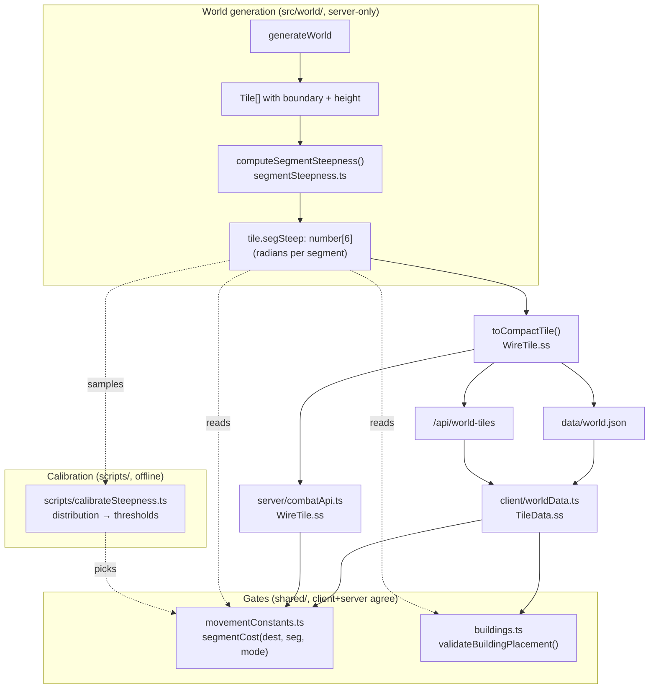
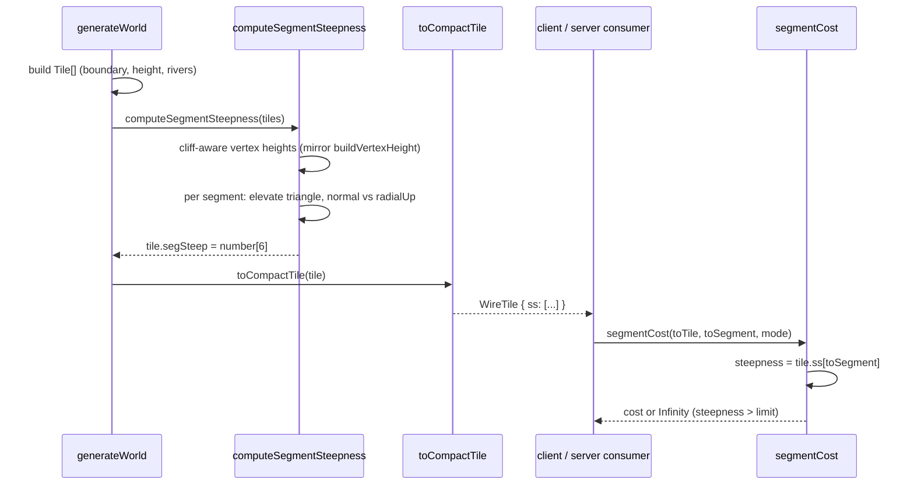
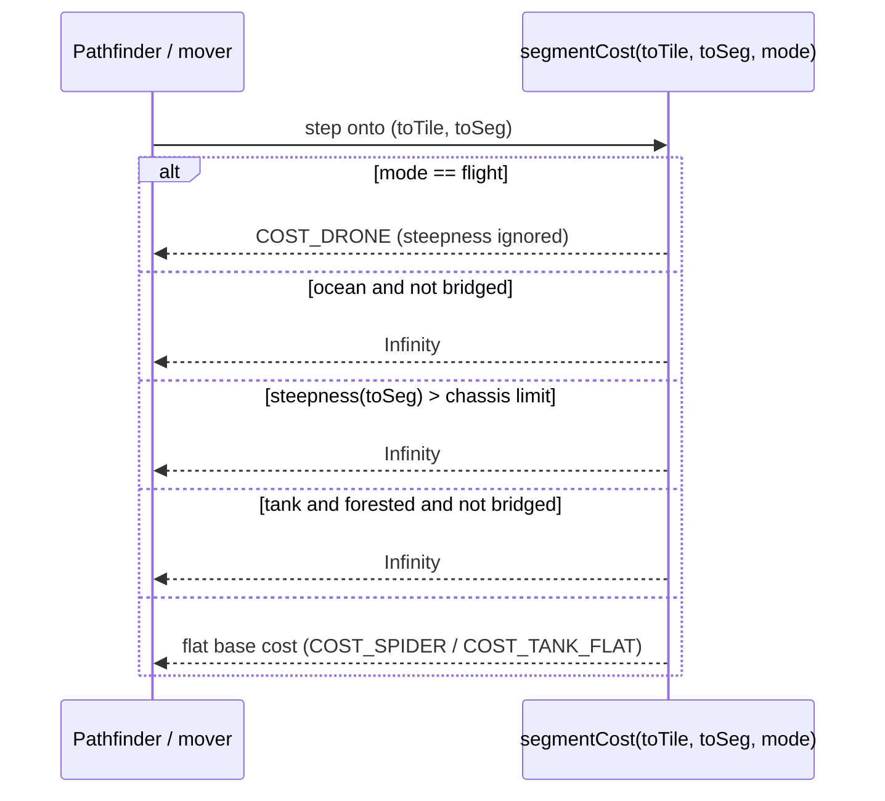

# Design Document: segment-steepness-gate

## Overview

Today, ground movement is gated by a *tile-level height-delta* rule: crossing a
hex border whose `|height(to) − height(from)|` exceeds a chassis climb limit is
impassable (`segmentCost`, test (3)). That gate is coarse — it works on whole
tiles, ignores which triangular segment a unit steps onto, and does not match
the slope the player actually sees on the 3D globe (the rendered gradient comes
from client-only cliff-aware vertex-height averaging in
`client/firstPersonTerrain.ts`).

This feature replaces the height-delta gate with a **per-segment steepness
gate**. Each hex is subdivided into 6 triangular segments; for every segment we
precompute, at world generation, the angle between that segment's
elevation-adjusted triangle normal and the local radial "up" on the sphere. That
angle — the *visible slope* of the segment — becomes the single authoritative
steepness metric. It gates two things:

1. **Movement** — a ground unit may step onto a destination segment only if the
   segment's steepness is within its chassis limit (`MAX_STEEP_WHEELED` for
   tanks, the larger `MAX_STEEP_LIMB` for spiders). Drones ignore it. Because the
   gate is on the *destination* segment (not the edge), gated steps compose:
   every reachable path is walkable.
2. **Building placement** — a building may not be placed on a segment steeper
   than `MAX_BUILD_STEEPNESS`.

The steepness values are computed once during world generation, stored as a
`segSteep: number[]` (6 radians per tile), and threaded through the wire format
so the client, server, and AI all read the same authoritative numbers — no
runtime recomputation, no client/server drift. Thresholds are **not guessed**:
a calibration script derives them empirically so roughly the same terrain the
old gate blocked stays blocked.

This is a surgical replacement (Option A): the ocean and forest gates are
untouched, and the "hills cost more" tank rule is removed (steepness is a binary
passable/impassable gate for now; a steepness-based movement *cost* is
explicitly deferred).

---

## Architecture

### Where steepness lives in the pipeline



### Why precompute at world generation

The slope the player sees in the first-person view is produced by
`buildVertexHeight` in `client/firstPersonTerrain.ts`: it lifts each boundary
vertex to a *cliff-aware cluster average* of the elevation heights of the tiles
meeting at that vertex, using the non-linear elevation curve
`elevationWorldHeight` (`pow(norm, ELEV_CURVE_EXP=4) * elevWorldScale`) and
pinning water clusters flat. Reproducing that averaging on the server *at
runtime* for every movement/placement check would be expensive and would risk
drifting from the client's rendering.

Instead we compute the authoritative steepness **once**, at world generation,
where the full tile graph is available. The server-side computation reproduces
the equivalent elevated-vertex heights (same curve, same cliff-aware cluster
averaging, same water pinning) using the 3D tile graph rather than the client's
2D flat projection. The result is stored per segment and travels over the wire,
so every consumer does a cheap array lookup and everyone agrees.

### Module responsibilities

| Module | Change | Rationale |
|--------|--------|-----------|
| `src/world/segmentSteepness.ts` **(new)** | `computeSegmentSteepness(tiles)`; pure geometry, sibling of `segmentGeometry.ts` | Server-side steepness computation, home for the world-gen pass |
| `src/world/generate.ts` | Call the new pass in `generateWorld`, populate `tile.segSteep` | The one place tiles are finalized (Step 4) |
| `src/world/types.ts` | Add `segSteep?: number[]` to `Tile` | Authoritative field |
| `shared/wireTypes.ts` | Add `ss?: number[]` to `WireTile` | Wire field-name mapping (`segSteep → ss`) |
| `src/world/compact.ts` | `toCompactTile` emits `ss` | Serialization |
| `client/worldData.ts` | `TileData` inherits `ss` from `WireTile` (no change beyond doc) | Client mirror |
| `server/combatApi.ts` | Add `ss` to its local `WireTile`; `rebuildTiles` restores `segSteep` | Movement validation on the authoritative server path |
| `shared/movementConstants.ts` | Replace height-delta gate with steepness gate; new `segmentCost` signature; new limits; remove hills-cost | Core movement rule |
| `shared/buildings.ts` | New `too-steep` rejection; `BuildSegTile` carries `segSteep` | Core placement rule |
| `client/buildController.ts` | `makePlacementContext` supplies `segSteep` | Threads steepness into placement |
| `client/movementRoute.ts`, `client/movementRange.ts`, `client/aiTurn.ts`, `src/world/movement.ts` | Migrate `segmentCost` call sites to the new signature | Signature change |
| `src/world/validate.ts` | Add `segSteep` integrity check | `npm run validate` coverage |
| `scripts/calibrateSteepness.ts` **(new)** | Derive thresholds from a generated world | Empirical thresholds |

---

## Data Models

### Authoritative `Tile` (src/world/types.ts)

```typescript
export interface Tile {
  // ... existing fields ...
  height?: number;              // discrete 0–11, already present
  /**
   * Per-segment visible steepness, in radians, one entry per side (index 0–5
   * for hexes, 0–4 for pentagons). segSteep[N] is the angle between segment N's
   * elevation-adjusted triangle normal and local radial "up" on the sphere:
   * 0 = dead flat, larger = steeper. Computed once at world generation from the
   * elevated-vertex model that mirrors the rendered first-person terrain.
   * Optional only so test/mock tiles can omit it; real generated worlds always
   * set it. Ocean/water tiles are computed like any other (their carved height
   * drives the slope of their banks).
   */
  segSteep?: number[];
}
```

**Validation rules**

- When present, `segSteep.length === tile.sides`.
- Every entry is a finite number in `[0, π/2]` (a plane's tilt from horizontal
  never exceeds 90°).
- Real generated worlds set it on every tile; mocks may omit it (consumers fall
  back to `0` — treated as flat/passable, preserving existing test behaviour).

### Wire format (shared/wireTypes.ts)

Field-name mapping addition: `segSteep → ss`.

```typescript
export interface WireTile {
  // ... existing fields ...
  h?: number;
  /**
   * Per-segment steepness in radians (segSteep). One entry per side. Values are
   * rounded to 4 decimals on the wire. Omitted only for tiles that have no
   * computed steepness (never the case for generated worlds).
   */
  ss?: number[];
}
```

`client/worldData.ts` `TileData` extends `WireTile`, so it inherits `ss`
automatically — no separate declaration, matching how `h`/`f`/`rv` are handled.

`server/combatApi.ts` maintains its own trimmed `WireTile` for combat requests;
it gains `ss?: number[]` and `rebuildTiles` maps it back onto `Tile.segSteep`,
so server-authoritative move validation sees the same steepness the client used.

---

## Components and Interfaces

### Component 1: Segment steepness computation (`src/world/segmentSteepness.ts`, new)

**Purpose**: Compute the per-segment visible steepness for every tile, once, at
world generation, reproducing the rendered elevated-vertex surface.

**Interface**:

```typescript
import { Tile } from './types.js';

/**
 * Vertical exaggeration applied to elevation when computing steepness. Must
 * equal the client's first-person ELEV_WORLD_SCALE / HEX_WORLD_RADIUS ratio
 * (currently 4.4) so the computed slope angle matches what the player sees in
 * the first-person view. If the client's exaggeration changes, change this and
 * recalibrate the thresholds.
 */
export const STEEP_VERTICAL_EXAGGERATION: number;

/**
 * Compute segSteep (radians per segment) for every tile in place, mutating each
 * tile's `segSteep`. Pure w.r.t. inputs other than the assignment. Safe to call
 * exactly once after tiles, boundaries, heights and rivers are finalized.
 */
export function computeSegmentSteepness(tiles: Tile[]): void;

/**
 * Compute the steepness (radians) of a single segment triangle, given the
 * elevated 3D positions of its three vertices (tile centre, boundary[N],
 * boundary[N+1]) and the outward radial direction at the segment centroid.
 * Exported for unit testing.
 */
export function segmentSteepnessAngle(
  centerElevated: Vec3,
  v0Elevated: Vec3,
  v1Elevated: Vec3,
  radialUp: Vec3,
): number;
```

**Responsibilities**:
- Build the cliff-aware vertex-height lookup on the 3D tile graph (mirror of
  `buildVertexHeight`): each boundary vertex's height is the average
  `elevationWorldHeight` over its non-cliff cluster of incident tiles, water
  clusters pinned flat.
- For each tile and each segment, elevate the three triangle vertices radially
  and compute the normal-vs-radial-up angle.
- Write `tile.segSteep`.

### Component 2: Movement gate (`shared/movementConstants.ts`)

**Purpose**: Decide the MP cost (or impassability) of stepping onto a
destination segment, gated by that segment's steepness.

**Interface** (new signature — see Low-Level Design for the migration):

```typescript
export const MAX_STEEP_WHEELED: number; // radians, calibrated (tanks)
export const MAX_STEEP_LIMB: number;    // radians, calibrated (spiders, > wheeled)

/**
 * Steepness (radians) of a destination segment, safe for tiles that lack
 * segSteep data (returns 0 = flat). Reads tile.segSteep (server) or tile.ss
 * (wire/client).
 */
export function segmentSteepness(tile: MovementTile, segment: number): number;

/**
 * Cost to move one segment step onto `toSegment` of `toTile`, for a chassis.
 * Returns Infinity when forbidden (ocean, forest for tanks, or steepness over
 * the chassis limit). The gate is on the DESTINATION segment, so it applies to
 * intra-hex repositioning as well as border crossings.
 */
export function segmentCost(
  toTile: MovementTile,
  toSegment: number,
  mode: MovementMode,
): number;
```

**Responsibilities**:
- Keep drone (flight) unaffected by steepness.
- Keep ocean (unless bridged) and forest (tanks) gates unchanged.
- Reject when destination-segment steepness exceeds the chassis limit.
- Charge a flat base cost otherwise (no more hills surcharge).

### Component 3: Placement gate (`shared/buildings.ts`)

**Purpose**: Reject building placement on a segment that is too steep.

**Interface**:

```typescript
export type PlacementRejectionReason =
  | 'invalid-tile'
  | 'invalid-segment'
  | 'impassable-tile'
  | 'too-steep'            // NEW
  | 'segment-occupied-unit'
  | 'segment-occupied-building'
  | 'tile-full'
  | 'not-adjacent-to-city'
  | 'breaks-through-street'
  | 'orphans-street-network';

export interface BuildSegTile {
  index: number;
  sides: number;
  neighbours: number[];
  groundPassable: boolean;
  /** Per-segment steepness in radians (from the tile's segSteep/ss). */
  segSteep: number[];       // NEW
}

export const MAX_BUILD_STEEPNESS: number; // radians, calibrated
```

**Responsibilities**:
- After the `impassable-tile` check (a pure per-segment property, independent of
  adjacency/through-street logic), reject with `too-steep` when
  `tile.segSteep[segment] > MAX_BUILD_STEEPNESS`.

---

## Sequence Diagrams

### World generation → wire → gate



### Movement step decision



---

## Low-Level Design

### Constants

```typescript
// shared/movementConstants.ts

/** Max traversable segment steepness (radians) per chassis. Spiders climb
 *  steeper than tanks. Drones ignore steepness. Values are CALIBRATED outputs
 *  (see scripts/calibrateSteepness.ts) — placeholders here, finalized by the
 *  calibration task. */
export const MAX_STEEP_WHEELED = /* calibrated */ 0;   // e.g. ~0.5 rad
export const MAX_STEEP_LIMB    = /* calibrated */ 0;   // e.g. ~0.9 rad, > wheeled

// shared/buildings.ts
export const MAX_BUILD_STEEPNESS = /* calibrated */ 0; // e.g. ~0.5 rad
```

The old `MAX_CLIMB_WHEELED` / `MAX_CLIMB_LIMB` (height-delta limits) are removed
once all call sites migrate. `HEIGHT_LEVELS`, `tileHeight`, `heightToBand`,
`bandToHeight` stay (still used by rendering and elevation banding).

### Steepness metric — formal definition

For segment `N` of a tile with centre `c` (a unit-sphere point) and ordered
boundary vertices `bₙ`:

```
Algorithm: segmentSteepnessAngle(N)
Require: base sphere points  c, a = b[N], d = b[(N+1) mod sides]  (|·| = 1)
Require: per-vertex elevated heights  h_c, h_a, h_d  (world units, same scale)
Ensure:  θ ∈ [0, π/2]  (radians)

  # 1. Push each vertex radially outward by its elevated height.
  C ← c · (1 + h_c)
  A ← a · (1 + h_a)
  D ← d · (1 + h_d)

  # 2. Triangle normal (winding-independent via absolute dot).
  n ← normalize( (A − C) × (D − C) )

  # 3. Local "up" = outward radial at the segment centroid.
  up ← normalize(c + a + d)

  # 4. Tilt of the segment plane from horizontal.
  θ ← acos( min(1, |dot(n, up)|) )
  return θ
```

This is rotation-invariant on the sphere (it uses only the local radial
direction), so it equals the slope the player perceives regardless of where the
hex sits on the globe — matching decision 1.

**Height scale (matching the render).** Heights must be in the *same length
units* as the horizontal triangle extent, or the angle is meaningless. The
per-vertex elevated height is:

```
h_vertex = clusterAvgNorm(vertex) · STEEP_VERTICAL_EXAGGERATION · hexRadiusSphere
```

where
- `clusterAvgNorm(vertex)` is the cliff-aware cluster average of
  `pow(tileHeight/(HEIGHT_LEVELS−1), ELEV_CURVE_EXP)` over the tiles meeting at
  that vertex (∈ [0,1]); water clusters pinned to the water level. This mirrors
  `elevationWorldHeight` / `buildVertexHeight` exactly (with `ELEV_CURVE_EXP = 4`).
- `hexRadiusSphere` is the tile's mean chord distance from `c` to its boundary
  vertices — the horizontal scale in sphere units.
- `STEEP_VERTICAL_EXAGGERATION = 4.4` equals the first-person
  `ELEV_WORLD_SCALE / HEX_WORLD_RADIUS`.

Because the vertical push is expressed in the same sphere units as the
horizontal extent (`hexRadiusSphere`), the resulting angle depends only on the
`ELEV_CURVE_EXP` shape and the `4.4` exaggeration — not on absolute tile size —
so it reproduces the rendered gradient consistently across the globe.

### `computeSegmentSteepness` algorithm

```
Algorithm: computeSegmentSteepness(tiles)
Ensure: every tile.segSteep is set, length == tile.sides, each ∈ [0, π/2]

  # Phase A — cliff-aware vertex heights (mirror of buildVertexHeight on 3D graph)
  vertexHeight ← buildSphereVertexHeight(tiles)   # (tileIndex, vertexKey) → height

  # Phase B — per-tile, per-segment angle
  for each tile t in tiles:
    if t.boundary.length < t.sides:
      t.segSteep ← array of t.sides zeros        # graceful fallback (test grids)
      continue
    hexR ← mean( chordDist(t.position3d, v) for v in t.boundary )
    h_c  ← vertexHeight(t.index, key(t.position3d))
    for N in 0 .. t.sides-1:
      a ← t.boundary[N];  d ← t.boundary[(N+1) mod t.sides]
      h_a ← vertexHeight(t.index, key(a))
      h_d ← vertexHeight(t.index, key(d))
      t.segSteep[N] ← segmentSteepnessAngle(
                         elevate(t.position3d, h_c),
                         elevate(a, h_a),
                         elevate(d, h_d),
                         radialUp(t.position3d, a, d))
```

`buildSphereVertexHeight` reproduces the client union-find:

```
Algorithm: buildSphereVertexHeight(tiles)
  # Group tiles by shared boundary vertex. On the Goldberg graph a boundary
  # vertex is shared by exactly the tile and two of its neighbours, so we can
  # find co-incident tiles via neighbour boundaries with a quantized vertex key.
  vTiles ← map<vertexKey, tileIndex[]>            # quantize coords to 1e-5
  for each tile t, for each v in t.boundary: vTiles[key(v)].push(t.index)

  for each (k, idxs) in vTiles:
    # union-find, join any pair NOT separated by a cliff edge
    for i<j in idxs:
      if not isCliffEdge(tiles[i], tiles[j]): union(i, j)
    # per cluster: average elevationWorldHeightNorm; pin water clusters flat
    ... (identical structure to client buildVertexHeight) ...
    store height per (tileIndex, k)
```

`isCliffEdge`, `isWaterTile`, `cliffHeight`, and the normalized
`elevationWorldHeightNorm` are ported into `segmentSteepness.ts` (or a tiny
shared helper) so the server reproduces the client's cliff/water treatment. This
is called out under **Cross-File Dependencies** below because it duplicates
logic from `client/firstPersonTerrain.ts` that must stay in sync.

**Preconditions**: `tiles` finalized — boundaries, `height`, and rivers all set
(so water tiles read as water). Called at `generateWorld` Step 4.5+, after
rivers.
**Postconditions**: `tile.segSteep` set for all tiles; deterministic for a given
tile set (no RNG).
**Loop invariant (Phase B)**: after processing segment `N`, `segSteep[0..N]`
hold finite angles in `[0, π/2]`.

### Movement gate — new `segmentCost`

The current signature is `segmentCost(tile, mode, fromTile?)` and the gate reads
`|tileHeight(to) − tileHeight(from)|`. The new gate needs the **destination
segment index** instead of the origin tile.

```typescript
export function segmentCost(
  toTile: MovementTile,
  toSegment: number,
  mode: MovementMode,
): number {
  // Drones: unaffected by terrain steepness or ground blocks.
  if (mode === 'flight') return COST_DRONE;

  const bridged = isBridged(toTile);

  // (2) Ocean impassable for ground unless bridged — UNCHANGED.
  if (isOcean(toTile) && !bridged) return Infinity;

  // (3) NEW steepness gate on the DESTINATION segment. A bridge deck is flat,
  //     so a bridged tile bypasses the gate (mirrors old bridge handling).
  if (!bridged) {
    const steep = segmentSteepness(toTile, toSegment);
    const limit = mode === 'limb' ? MAX_STEEP_LIMB : MAX_STEEP_WHEELED;
    if (steep > limit) return Infinity;
  }

  // Spider: flat cost on any passable segment.
  if (mode === 'limb') return COST_SPIDER;

  // (4) Tank forbidden from forest — UNCHANGED.
  if (!bridged && isForested(toTile)) return Infinity;

  // (5) hills-cost-more REMOVED — tanks pay flat cost everywhere.
  return COST_TANK_FLAT;
}
```

**Preconditions**: `toSegment ∈ [0, toTile.sides)`. `toTile` is a real
destination tile.
**Postconditions**: returns `Infinity` iff the step is forbidden for `mode`;
otherwise a positive flat base cost. Independent of the origin tile (the gate is
a property of the destination segment), so composing steps never produces an
unwalkable prefix of a walkable path.

`segmentSteepness` reads whichever field is present:

```typescript
export function segmentSteepness(tile: MovementTile, segment: number): number {
  const ss = (tile as { segSteep?: number[] }).segSteep
          ?? (tile as { ss?: number[] }).ss;
  if (!ss || segment < 0 || segment >= ss.length) return 0; // flat fallback
  return ss[segment];
}
```

`MovementTile` gains optional `segSteep?: number[]` and `ss?: number[]`.

### Call-site migration

`segmentCost` currently takes `(tile, mode, fromTile?)`; the border step also
needs the *arrival segment* on the destination tile. The arrival segment on a
border crossing is `destTile.neighbours.indexOf(fromTileIndex)` (the segment
facing back toward the origin) — this is already computed in the pathfinders and
in `computeMovePath`. Intra-hex pivots already know their destination segment.

| Call site | Current | Migrated |
|-----------|---------|----------|
| `src/world/movement.ts` `moveUnit` | `segmentCost(destTile, mode, tiles[fromIndex])` | compute `arrivalSeg = destTile.neighbours.indexOf(fromIndex)`, then `segmentCost(destTile, arrivalSeg, mode)` |
| `src/world/movement.ts` `pathMovementCost` / `maxHexesWithAttack` / `maxReachableHexes` | `segmentCost(tiles[path[i]], mode, tiles[path[i-1]])` | derive arrival segment from `tiles[path[i]].neighbours.indexOf(path[i-1])` |
| `server/combatApi.ts` `computeMovePath` | pivot: `segmentCost(prevTile, mode)`; cross: `segmentCost(destTile, mode, prevTile)` | pivot steps price each intermediate segment; cross prices the arrival segment |
| `client/movementRoute.ts`, `client/movementRange.ts` | intra: `segmentCost(tile, mode)`; cross: `segmentCost(nTile, mode, tile)` | intra: `segmentCost(tile, mode, targetSeg)`; cross: `segmentCost(nTile, mode, arrivalSeg)` |
| `client/aiTurn.ts` | pivot: `segmentCost(tiles[path[i-1]], mode)`; cross: `segmentCost(tiles[path[i]], mode, tiles[path[i-1]])` | same arrival-segment derivation |
| `shared/movementConstants.ts` `hexEntryCost` (deprecated forwarder) | `segmentCost(tile, mode)` | forward with a representative segment (0) or the tile's least-steep segment; keep the deprecation and note it no longer models the border gate |
| `shared/movementConstants.ts` `pivotStepCost` | unchanged (still per-mode flat cost) | now also steepness-gated by the caller passing the target segment to `segmentCost` |
| `shared/movementConstants.ts` `segmentStepCost` | free lower-bound intra-hex arc | must be steepness-gated: an intra-hex reposition onto a steep segment is now blocked; the "free within a hex" shortcut is REMOVED (decision 3) |

Because the pathfinders already iterate segment-by-segment (they encode state as
`tile*6 + segment`), the destination segment is available at every edge — the
migration is mechanical.

**Intra-hex gating (decision 3).** The old model treated same-hex repositioning
as ungated (only border steps had a height delta). Now every segment step —
including intra-hex — calls `segmentCost(tile, targetSeg, mode)` and can be
blocked if `targetSeg` is too steep. `segmentStepCost(from, to)` must be updated
to sum `pivotStepCost`-priced steps that each pass the steepness gate, returning
`Infinity` if any intermediate segment on the chosen arc is impassable.

### Placement gate

```typescript
// shared/buildings.ts — inside validateBuildingPlacement, right after the
// impassable-tile check and before occupancy checks:

if (tile.segSteep[placement.segment] > MAX_BUILD_STEEPNESS) {
  return {
    legal: false,
    reason: 'too-steep',
    message: 'Cannot build on a slope this steep.',
  };
}
```

`makePlacementContext` (client/buildController.ts) and any server placement
context must populate `BuildSegTile.segSteep` from the tile's `ss`/`segSteep`
(defaulting to a zero-filled array of length `sides` when absent, so mocks and
legacy tiles are treated as flat/buildable).

**Preconditions**: `placement.segment` already range-checked by the preceding
`invalid-segment` guard.
**Postconditions**: independent of adjacency/through-street logic; a pure
per-segment property, so it can be evaluated before the more expensive
graph invariants.

### Thresholds — calibration (decision 5)

Thresholds are **not** hardcoded guesses. A script derives them so that roughly
the same terrain the old height-delta gate blocked stays blocked.

```typescript
// scripts/calibrateSteepness.ts  (run: node scripts/calibrateSteepness.js)

// 1. generateWorld(seed) for one or a few seeds.
// 2. For every ground-passable (tile, segment): collect segSteep[segment].
// 3. Also compute, for every border, the OLD gate verdict
//    (|height delta| > MAX_CLIMB_WHEELED / _LIMB) to know the old blocked share.
// 4. Report the steepness distribution (histogram, percentiles) and, for a
//    sweep of candidate thresholds, the fraction of segments/borders that would
//    be blocked.
// 5. Pick MAX_STEEP_WHEELED, MAX_STEEP_LIMB (> wheeled), MAX_BUILD_STEEPNESS so
//    the blocked fraction ≈ the old gate's blocked fraction (neither fully
//    impassable nor trivially passable). Print recommended constants.
```

Calibration targets (documented, not asserted as pinned values):
- `MAX_STEEP_WHEELED < MAX_STEEP_LIMB` (spiders climb steeper — decision 3).
- Blocked-segment fraction under the wheeled limit ≈ old wheeled blocked
  fraction; likewise for limb.
- `MAX_BUILD_STEEPNESS` roughly aligned with (or slightly stricter than) the
  wheeled movement limit — you should not be able to build where a tank cannot
  stand.

The chosen numbers are a **task output**, written into the constants with a
comment citing the calibration seed(s) and the observed distribution.

---

## Correctness Properties

Universal statements the implementation must satisfy (verified by
property/range tests per the testing rules — no pinned formula values):

### Property 1: Steepness range

`∀ tile, seg: 0 ≤ tile.segSteep[seg] ≤ π/2`.

**Validates: Requirements 1.1**

### Property 2: Array length matches sides

`∀ generated tile: tile.segSteep.length === tile.sides`.

**Validates: Requirements 2.1**

### Property 3: Rotation invariance

Applying an arbitrary rotation matrix to a tile's `position3d` and `boundary`
(with the same heights) leaves every `segmentSteepnessAngle` unchanged (within
float tolerance).

**Validates: Requirements 1.2**

### Property 4: Flat implies zero

A tile whose whole neighbourhood is a single flat height has `segSteep[seg] ≈ 0`
for all segments.

**Validates: Requirements 1.3**

### Property 5: Monotonicity

Increasing the height contrast across a segment's vertices (steeper elevated
triangle) does not decrease its steepness angle.

**Validates: Requirements 1.4**

### Property 6: Drones ignore steepness

`∀ tile, seg: segmentCost(tile, seg, 'flight') === COST_DRONE`.

**Validates: Requirements 3.1**

### Property 7: Chassis ordering

`∀ tile, seg`, if a wheeled step is allowed (`segmentCost(...,'wheeled') < ∞`)
then the limb step is also allowed (`< ∞`), because
`MAX_STEEP_WHEELED < MAX_STEEP_LIMB`.

**Validates: Requirements 3.2**

### Property 8: Gate is destination-only (path composability)

`segmentCost` for a step depends only on `(toTile, toSegment, mode)`, not on any
origin — so any sub-path of a finite-cost path is itself finite-cost.

**Validates: Requirements 3.3**

### Property 9: Ocean and forest gates preserved

For non-bridged tiles, ocean is `Infinity` for ground modes and forest is
`Infinity` for wheeled, regardless of steepness.

**Validates: Requirements 3.4**

### Property 10: Placement gate

`validateBuildingPlacement` returns `too-steep` iff
`tile.segSteep[segment] > MAX_BUILD_STEEPNESS` and the tile/segment passed the
preceding validity and passability checks.

**Validates: Requirements 4.1**

### Property 11: Wire round-trip

`toCompactTile` → wire → `rebuildTiles` preserves `segSteep` within the wire
rounding tolerance (4 decimals).

**Validates: Requirements 2.2**

### Property 12: No "free within a hex"

An intra-hex reposition onto a too-steep segment returns `Infinity` (the old
free-pivot shortcut is gone).

**Validates: Requirements 3.5**

---

## Error Handling

### Missing `segSteep` (legacy save / mock tile)

**Condition**: a tile has no `segSteep`/`ss` (old save, hand-built test tile).
**Response**: `segmentSteepness` returns `0` (flat) and
`BuildSegTile.segSteep` defaults to a zero array — the segment is treated as
passable/buildable, so no crash and behaviour degrades to "steepness never
blocks".
**Recovery**: regenerating tiles from the seed (the normal client load path via
`/api/world-tiles`) repopulates `segSteep`, since tiles are always regenerated,
not persisted in saves.

### Pentagon tiles

**Condition**: 12 tiles have 5 sides.
**Response**: `segSteep.length === 5`; the segment loop uses `tile.sides`, and
`(N+1) mod sides` wraps correctly. Cities are never on/adjacent to pentagons
(existing invariant), so placement on pentagons is already constrained; movement
still gates each of the 5 segments.

### Degenerate triangle (coincident vertices)

**Condition**: a boundary vertex coincides with the centre (should not happen on
a real Goldberg tile).
**Response**: `normalize` of a zero cross-product returns `{0,0,0}`; guard by
treating a zero-length normal as steepness `0` (flat) rather than `NaN`.

---

## Testing Strategy

### Unit tests

- `segmentSteepness.test.ts` (new, < 300 lines):
  - Flat neighbourhood ⇒ all-zero angles (property 4).
  - Rotation invariance over random rotations (property 3).
  - A synthetic steep step (one vertex much higher) yields a larger angle than a
    gentle one (property 5), asserted as a *relative* comparison, not a pinned
    number.
  - Range `[0, π/2]` over a generated world sample (property 1) and length ==
    sides (property 2).
- `movementConstants` tests: extend existing movement tests for the new
  signature — drone ignores steepness (6), chassis ordering (7),
  destination-only gate (8), ocean/forest preserved (9), intra-hex gating (12).
  Update existing height-delta tests to the steepness model.
- `buildings` tests: `too-steep` rejection path (10), ordering relative to
  `impassable-tile`, and that a flat segment still builds.

### Property-based testing

**Library**: `fast-check` (already used — see
`src/world/__tests__/segmentGeometry.test.ts`).

- Generate random rotations and height assignments; assert rotation invariance
  and range bounds.
- Generate random small tile grids and assert path composability (property 8):
  any prefix of a finite-cost path is finite-cost.

### Integration / world-level

- `src/world/validate.ts` gains a check: every tile has `segSteep` of length
  `sides` with entries in `[0, π/2]`. `npm run validate` then covers the new
  field on the real generated `data/world.json` (decision 2).
- Wire round-trip test (property 11) alongside the existing `compact.test.ts`
  patterns.

### Calibration (manual, not a unit test)

`node scripts/calibrateSteepness.js` prints the distribution and recommended
constants; run once to set the thresholds and re-run if the elevation curve or
exaggeration changes.

---

## Performance Considerations

- `computeSegmentSteepness` runs once per world generation. The vertex-height
  union-find is `O(tiles × sides)` with small per-vertex clusters (≤ 3 tiles on
  a Goldberg grid), comparable to the existing terrain passes. `FREQUENCY = 100`
  yields a large tile count, so the pass should avoid per-segment map
  allocations — build the vertex-height lookup once, then index it.
- Runtime gate checks are `O(1)` array lookups (`tile.ss[segment]`), strictly
  cheaper than the old `tileHeight` delta (which also did band fallbacks).
- Wire size grows by up to 6 rounded numbers per tile. Values are rounded to 4
  decimals to bound JSON growth; `data/world.json` size impact should be
  checked during implementation (acceptable given tiles are also regenerated
  server-side for the client via `/api/world-tiles`).

## Security Considerations

None specific. All computation is deterministic and local; no new network
surface. The server already re-validates moves (`validateMovePath`), and moving
the gate onto authoritative precomputed `segSteep` (echoed back through
`server/combatApi.ts`) keeps the server able to reject illegal client moves.

---

## Cross-File Dependencies

Per `conventions.md` "Cross-File Dependencies", these must be kept in sync:

| When editing | Also update |
|---|---|
| `src/world/types.ts` (`segSteep`) | `shared/wireTypes.ts` (`ss`), `client/worldData.ts` (mirror), `src/world/compact.ts` (serialize) |
| `src/world/compact.ts` (`ss`) | `client/worldData.ts` interfaces, `server/combatApi.ts` local `WireTile` + `rebuildTiles` |
| `shared/movementConstants.ts` (`segmentCost` signature) | `src/world/movement.ts`, `server/combatApi.ts` (`computeMovePath`), `client/movementRoute.ts`, `client/movementRange.ts`, `client/aiTurn.ts` |
| `client/firstPersonTerrain.ts` (`buildVertexHeight`, `elevationWorldHeight`, `ELEV_CURVE_EXP`, `MAX_SLOPE_RENDER` cliff logic) | `src/world/segmentSteepness.ts` reproduces this model — a change to the visual gradient must be reflected in the steepness computation (and the thresholds recalibrated). The `4.4` exaggeration in `STEEP_VERTICAL_EXAGGERATION` tracks first-person `ELEV_WORLD_SCALE / HEX_WORLD_RADIUS`. |
| `shared/buildings.ts` (`BuildSegTile.segSteep`, `too-steep`) | `client/buildController.ts` (`makePlacementContext`) and any server placement context |

## Import & Convention Rules Honored

- All imports use `.js` extensions; named exports only; no default exports.
- `segmentSteepness.ts` lives in `src/world/` (server-only) and is called from
  `generate.ts`; it never enters the client bundle. The client reads the
  precomputed `ss` from the wire.
- The movement and placement gates stay in `shared/` so client, server, and AI
  agree (same pattern as `shared/rangeCheck.ts`).

## Documentation Updates (docs-as-we-go)

- `COMBAT_RULES.md`: replace the height-delta climb-gate description with the
  per-segment steepness gate (movement) and add the building `too-steep` rule.
- `docs/architecture/world-generation.md`: document the `segSteep` world-gen
  pass, the elevated-vertex model, and its relationship to the first-person
  rendered gradient.
- `DECISIONS.md`: pointer entry — Decision / Why / Impact for replacing the
  climb gate with the steepness gate, plus the calibration approach and the
  removal of the hills movement surcharge.
- Update the memory graph (`MovementSystem`, `WorldGeneration`, `HexSegment`)
  with the new steepness metric and gate once implemented.
