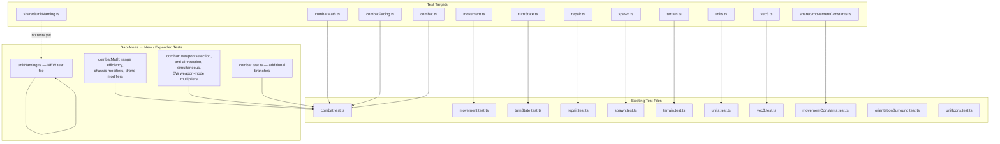

# Design Document: Unit Test Improvements

## Overview

The Drone Domination test suite already has solid breadth — every major module has a corresponding test file — but depth and quality vary significantly across modules. Several critical game-logic paths (combat weapon selection, anti-air reaction fire, range efficiency, drone damage penalties, simultaneous resolution, EW weapon-mode multipliers, unit naming, and the `shared/unitNaming.ts` module) have little or no direct behavioural coverage. Meanwhile some existing tests are tautological (verifying constants equal themselves), mock-heavy without asserting real effects, or test only the happy path of complex branching logic.

This document analyses the current state, maps each gap to the source module it covers, and defines the design for new and improved tests. The goal is not 100 % line coverage but **meaningful confidence in correctness**: every significant branch, formula, and validation rule should be exercised by at least one test that would fail if the logic were subtly wrong.

---

## Architecture



---

## Components and Interfaces

### Component 1: `combatMath.ts` — Pure Damage Formulas

**Purpose**: Stateless arithmetic for the combat engine. Contains range efficiency, chassis modifiers, drone incoming-damage modifiers, and the core formula.

**Current coverage gaps**:
- `calculateRangeEfficiency` is never tested directly.
- `getChassisAttackModifier` is never tested directly.
- `calculateModifiedAttackPower` is never tested directly; only indirectly exercised via integration tests.
- `applyDroneIncomingDamageModifier` — drone path tested only indirectly through `resolveAttack`.
- Drone modifier for `antiAir` mode (no penalty, always 1.0) — not explicitly asserted.

**Interface**:
```typescript
calculateRangeEfficiency(distance: number): number
getChassisAttackModifier(unit: Unit): number   // 0.50 drone | 0.75 spider | 1.00 tank
calculateModifiedAttackPower(unit, base, orientationBonus, distance): number
applyDroneIncomingDamageModifier(mode, targetUnit, damage): number
calculateFormulaDamage(attackPower, effectiveDefence): number
isDrone(unit): boolean
```

**New tests needed**:
- `calculateRangeEfficiency`: distance 1 → 1.0, distance 2 → 0.9, distance 5 → 0.6, minimum 0.
- `getChassisAttackModifier`: drone=0.50, spider=0.75, tank=1.00, no-movement=1.00.
- `calculateModifiedAttackPower`: tank at distance 2 with orientation 1 produces expected value.
- `applyDroneIncomingDamageModifier`: direct→×0.33, splash→×0.50, antiAir→×1.00; non-drone unchanged; minimum 1 enforced.

---

### Component 2: `combat.ts` — Weapon Selection and Anti-Air

**Purpose**: Orchestrates full attack resolution, weapon mode selection, anti-air reaction fire, and simultaneous resolution.

**Current coverage gaps**:
- `chooseWeaponOption` tie-breaking logic — anti-air preference for drones vs. direct preference for ground targets.
- `resolveAttack` with only `antiAir` weapon against a **ground** target — should be invalid.
- `resolveAttack` with only `antiAir` weapon against a **drone** — should succeed.
- `resolveAntiAirReactionFireForTile`: stops after drone is destroyed mid-tile (early exit path).
- `resolveReactionFire`: ground unit — no reaction fire triggered; drone across multi-tile path; drone destroyed mid-path.
- `resolveSimultaneousAttacks`: both units survive; one unit is killed — verifies snapshot semantics.
- EW weapon-mode multipliers (`EW_EFFECTIVENESS_DIRECT = 0.50`, `EW_EFFECTIVENESS_SPLASH = 0.75`, `EW_EFFECTIVENESS_ANTIAIR = 1.00`) — never tested directly; only the total `getDefencePower` result is checked without asserting the multiplier breakdown.
- `getDefencePower` with explicit `weaponMode` parameter — only the default `'antiAir'` mode is tested.

**New tests needed** (see Data Models section for specifics).

---

### Component 3: `shared/unitNaming.ts` — Unit Name Generation

**Purpose**: Pure naming tables and `buildUnitNameParts`. Used by both client and server. Currently has **zero dedicated tests**.

**Interface**:
```typescript
buildUnitNameParts(attrs: UnitAttributes): UnitNameParts
// → { movementKey, speedWord, typeWord, descriptors[] }
SPEED_NAMES, TYPE_NAMES, ATTRIBUTE_NAMES  // exported tables
```

**New tests needed** — complete new test file `shared/__tests__/unitNaming.test.ts`:
- Correct movement key selection (flight > limb > wheeled).
- Speed word mapping for each level 1–5.
- Type word mapping for each movement category.
- Descriptor selection: top-2 non-movement attrs by value.
- No descriptors when all non-movement attrs are zero.
- Only 1 descriptor when exactly one non-movement attr > 0.
- Tie-breaking among equal attribute values (stable or at least deterministic).
- `generateUnitName` (from `units.ts`) produces a string containing the stat tuple.

---

### Component 4: `combat.test.ts` — Additional Branching

**Purpose**: Extend the existing combat test file to cover missing branches already partially tested.

**Gaps in existing `combat.test.ts`**:
- `resolveAttack` with destroyed attacker or destroyed target — covered for attacker but not for target.
- Friendly-fire rejection — covered.
- Anti-air-only unit targeting ground → invalid.
- Anti-air-only unit targeting drone → valid.
- `resolveAttack` with no weapon (no kinetic, no splash, no antiAir, no rangeAttack) → "No valid weapon modes" result.
- Range falloff effect on damage — two attacks at different distances; closer attack deals more damage.
- Drone target takes reduced Direct Fire damage (×0.33); assertion is indirect only.
- Drone target takes reduced Splash Fire damage (×0.50); never directly asserted.
- `getDefencePower` with `weaponMode: 'direct'` — ew field should be halved.
- `getDefencePower` with `weaponMode: 'splash'` — ew field should be ×0.75.

---

## Data Models

### New: `combatMath` unit test additions

```typescript
// Range efficiency table
describe('calculateRangeEfficiency', () => {
  it('distance 1 → 1.00')
  it('distance 2 → 0.90')
  it('distance 5 → 0.60')
  it('distance 10 → 0.10')
  it('distance 11 → 0 (floor at 0)')
  it('distance 0 → treated as distance 1')
})

// Chassis modifiers
describe('getChassisAttackModifier', () => {
  it('drone unit → 0.50')
  it('spider unit → 0.75')
  it('tank unit → 1.00')
  it('unit with no movement attributes → 1.00')
})

// Modified attack power composition
describe('calculateModifiedAttackPower', () => {
  it('tank, base=3, orientation=1, distance=1 → 3*1.00*1.00+1 = 4')
  it('drone, base=3, orientation=0, distance=1 → 3*0.50*1.00+0 = 1.5')
  it('tank, base=3, orientation=0, distance=2 → 3*1.00*0.90+0 = 2.7')
  it('minimum result is 0.01 (no zero-division)')
})

// Drone incoming damage modifiers
describe('applyDroneIncomingDamageModifier', () => {
  it('direct fire on non-drone → unchanged')
  it('direct fire on drone: 18 * 0.33 = round(5.94) = 6, min 1')
  it('splash fire on drone: 10 * 0.50 = 5')
  it('antiAir on drone → unchanged (1.00)')
  it('result is always at least 1')
})
```

### New: `unitNaming.test.ts`

```typescript
describe('buildUnitNameParts', () => {
  it('uses flightMovement key when present')
  it('uses limbMovement key when flight absent')
  it('uses wheeledMovement as fallback')
  it('SPEED_NAMES maps 1 → Loitering, 5 → Sprinter')
  it('TYPE_NAMES maps flightMovement → Drone')
  it('TYPE_NAMES maps limbMovement → Spider')
  it('TYPE_NAMES maps wheeledMovement → Tank')
  it('top 2 non-movement attributes produce 2 descriptors')
  it('only 1 attribute → 1 descriptor')
  it('no non-movement attributes → 0 descriptors')
  it('attributes with value 0 are excluded from descriptors')
  it('highest-value attribute appears first in descriptors')
})

describe('generateUnitName (units.ts)', () => {
  it('output contains speed word')
  it('output contains type word')
  it('output contains stat tuple with Mov value')
})
```

### Extended: `combat.test.ts`

```typescript
describe('getDefencePower — weapon mode EW multipliers', () => {
  it('direct mode: ew field is ewRaw × 0.50')
  it('splash mode: ew field is ewRaw × 0.75')
  it('antiAir mode: ew field is ewRaw × 1.00')
  it('same ewRaw produces lower total for direct than antiAir')
})

describe('anti-air only unit', () => {
  it('anti-air only vs ground target → invalid (Anti-Air weapons can only target drones)')
  it('anti-air only vs drone target → valid attack')
  it('chosen weapon mode is antiAir when attacker only has antiAir')
})

describe('resolveAttack edge cases', () => {
  it('no weapon at all → wasValid false, No valid weapon modes')
  it('destroyed target → wasValid false')
  it('range falloff: distance-3 attack deals less damage than distance-1 attack')
  it('drone target direct fire → damage is ×0.33 vs non-drone equivalent')
  it('drone target splash fire → damage is ×0.50 vs non-drone equivalent')
})

describe('resolveReactionFire', () => {
  it('ground unit movement → no reaction fire events')
  it('drone moving through 1 enemy AA tile → 1 reaction event')
  it('drone moving through 2 consecutive enemy AA tiles → 2 reaction events')
  it('drone destroyed mid-path → movement stops, remaining tiles not processed')
  it('same AA unit cannot react twice in one action')
})

describe('resolveSimultaneousAttacks', () => {
  it('both units survive → both deal damage independently')
  it('one unit would be dead before the other attacks → snapshot ensures both attacks resolve')
  it('returns 2 CombatResult objects')
})
```

---

## Error Handling

### Anti-tautological test rule
Tests must not simply assert that a constant equals itself (`expect(DEFENCE_SCALE).toBe(0.75)` without using it in a formula). Every constant-validation test should exercise the constant through at least one derived calculation.

### No mock-only assertions
Tests in `src/world/__tests__/` must assert on observable side effects or return values, not merely that a spy was called. The `unitIcons.test.ts` approach of checking `ctx.arc` was called is acceptable where canvas interaction is the only observable output, but should be supplemented with structural property tests.

### Isolation of pure functions
`combatMath.ts` and `combatFacing.ts` are pure — tests must not import game-state types like `TurnState` or `Unit[]` arrays. Each test should construct minimal inputs.

---

## Testing Strategy

### Unit Testing Approach

Each module gets tests that exercise its own contracts in isolation. Shared helpers (`makeTile`, `makeUnit`) are defined once per file and kept minimal.

Priority order for new tests (highest value first):
1. `combatMath.ts` pure-function gaps — zero setup, high formula risk.
2. `unitNaming.ts` — entirely untested module, pure functions.
3. `combat.ts` weapon selection / anti-air / simultaneous — complex branching.
4. `getDefencePower` EW mode multipliers — subtle correctness, easy to get wrong.

### Property-Based Testing Approach

Not applicable for this pass — the existing formula tests are already example-based and the logic is deterministic. Property tests would be valuable for `calculateFormulaDamage` (e.g., monotonicity in attack power) but are out of scope for this improvement cycle.

### Integration Testing Approach

`combat.test.ts` already acts as an integration test for the full attack pipeline. New tests added there follow the same pattern: build a minimal grid with `createTestGrid()`, create units with `makeUnit()`, and assert on `CombatResult` fields.

---

## Performance Considerations

All new tests operate on in-memory data structures with at most 7 tiles. No performance concerns.

---

## Security Considerations

N/A — this is a unit test suite.

---

## Dependencies

No new runtime dependencies required. All tests use the existing Vitest framework (`"vitest": "^4.1.6"`) already present in `package.json`.

New test files follow the existing pattern:
- Import only named exports (no default exports in this project).
- Use `.js` extension on all import paths (ESM resolution rule).
- Place new files in the appropriate `__tests__/` directory.

---

## Correctness Properties

The following properties must hold across all new and modified tests:

### Property 1: Range efficiency is monotonically non-increasing with distance

`calculateRangeEfficiency(d+1) <= calculateRangeEfficiency(d)` for all `d >= 1`. Longer range should never improve a declared attack.

**Validates: Requirements 1.6**

### Property 2: Modified attack power is non-negative

`calculateModifiedAttackPower(unit, base, bonus, dist) >= 0.01` for any valid inputs, preventing zero-division in the damage formula.

**Validates: Requirements 3.5**

### Property 3: Drone incoming modifier never increases damage

For `weaponMode = 'direct' | 'splash'`, `applyDroneIncomingDamageModifier(mode, droneUnit, d) <= d` for all `d >= 1`. Drone modifiers can only reduce or preserve damage, never amplify it.

**Validates: Requirements 4.6**

### Property 4: Formula damage is bounded within [1, 30]

`calculateFormulaDamage(ap, ed)` always returns a value in `[MIN_DAMAGE, MAX_DAMAGE]` = `[1, 30]`, regardless of extreme inputs.

**Validates: Requirements 5.1**

### Property 5: Higher attack power never produces lower damage against equal defence

For fixed `ed`, `calculateFormulaDamage(ap1, ed) <= calculateFormulaDamage(ap2, ed)` when `ap1 < ap2`. The damage formula is monotonically non-decreasing in attack power.

**Validates: Requirements 5.2**

### Property 6: Higher defence never produces higher damage from equal attack

For fixed `ap`, `calculateFormulaDamage(ap, ed1) >= calculateFormulaDamage(ap, ed2)` when `ed1 < ed2`. The damage formula is monotonically non-increasing in effective defence.

**Validates: Requirements 5.3**

### Property 7: EW contribution is strictly lower under direct mode than antiAir mode

For any non-zero `ewRaw`, `getDefencePower(target, units, tiles, 'direct').ew < getDefencePower(target, units, tiles, 'antiAir').ew`. The EW multiplier 0.50 < 1.00 must produce a strictly smaller ew component.

**Validates: Requirements 7.4**

### Property 8: Simultaneous resolution is symmetric for identical units

Two identical units attacking each other via `resolveSimultaneousAttacks` must sustain equal damage, since neither gets temporal priority over the other.

**Validates: Requirements 11.3**

### Property 9: Unit names always include a speed word and type word

`buildUnitNameParts(attrs)` always returns non-empty `speedWord` and `typeWord` strings for any `UnitAttributes`, even when all non-movement attributes are zero.

**Validates: Requirements 6.12**

### Property 10: Anti-air reaction fire does not trigger for ground units

`resolveReactionFire` with a non-drone (wheeled or limb) unit always returns an empty array regardless of the path, because ground units never trigger anti-air reaction fire.

**Validates: Requirements 10.1**
